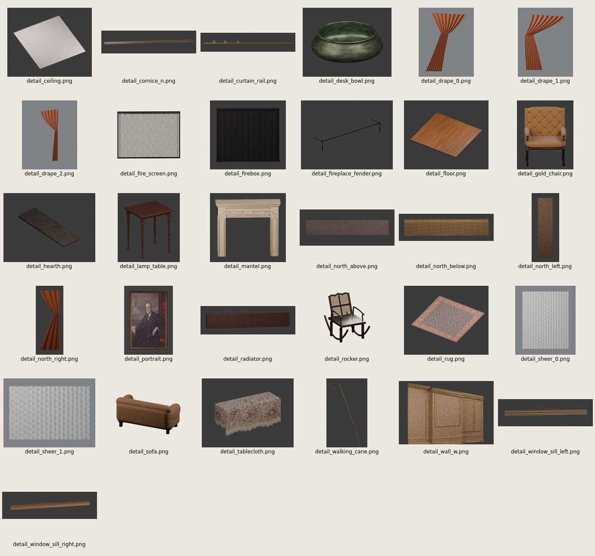

# Photo to Scene

Photo to Scene turns one reference photograph into a staged Blender scene. The workflow moves through a floorplan, neutral blockout, object identification, per-object detail, integration, and materials. A fresh builder and critic handle each stage, while GOTO sends a defect back to the stage that owns it.

The handoffs are files rather than hidden context. Machine-checked spatial contracts carry source evidence, local-to-room frames, footprints, fronts, semantic regions, relationships, ownership, and visible apertures from blockout through the final material render. [The stage reference](docs/STAGES.md) defines the contracts, retry limits, validation gates, and resume behavior.

## Run a reconstruction

Requirements:

- Bash 4 or newer, GNU coreutils, and `jq`
- Nix with `nix-shell` enabled; the workflow uses it to provide Python, Blender, and ImageMagick
- an installed and authenticated Codex CLI
- enough CPU time and disk space for repeated Cycles renders

From the repository root, give the run its own work directory and pass an absolute path to one photograph:

```sh
PHOTO_TO_SCENE_ROOT="$PWD/work" ./pipeline.sh /absolute/path/to/photo.jpg
```

The driver creates the work directory, seeds its generic asset builder, and writes durable state after each attempt. To resume from a particular stage, reuse the same directory and set `PHOTO_TO_SCENE_STAGE`:

```sh
PHOTO_TO_SCENE_ROOT="$PWD/work" \
PHOTO_TO_SCENE_STAGE=integrate \
./pipeline.sh /absolute/path/to/photo.jpg
```

Valid resume targets are `floorplan`, `blockout`, `identify`, `detail`, `object:<id>`, `integrate`, and `materials`. Set `BOTQ_ARTIFACTS_DIR` to override the final artifact directory.

The main outputs are:

- `work/floorplan.json`: room geometry, camera, fixed features, and scale evidence
- `work/objects.json`: the visible-object inventory and spatial contracts
- `work/assets/<id>.py`: procedural Blender builders for individual objects
- `work/state/*.png`: stage, overlay, object, and final renders
- `work/state/scores.md`: attempt scores, changes, GOTO history, and critic verdicts

## Stages

```text
photo
  ↓
floorplan → blockout → identify → detail per object → integrate → materials
    ↑          ↑                       ↑               ↓          ↓
    └────────────────────── GOTO ─────────────────────┴──────────┘
```

Floorplan establishes the room and camera. Blockout becomes the spatial authority. Identify checks the object inventory and crops. Detail builds and reviews every object independently. Integrate assembles the scene and measures the result against the spatial contracts. Materials adds the shell surfaces, lighting, colour management, and final render without relaxing those contracts.

## Results so far

The scores below come from two runs of the same private evaluation scene. “Gate score” is the final machine-gate result, while “critic score” is the last available visual evaluation before a hard gate prevents further criticism.

| Run | Workflow SHA | Gate score | Critic score | Binding stage | What changed |
|---|---|---:|---:|---|---|
| Run 3 | Unversioned run artifact | Pass (legacy envelope gate) | 5/10 | Blockout | Establishes the staged baseline. The legacy gate checks outer axis-aligned bounds but does not preserve directional or internal spatial structure. |
| v4 run 1 | `81defd9544e6f700500cbc37cb3e496960e69e7c` | 0/10 | 5/10 | Materials | Fixes sectional placement and facing, the black far window, and duplicated basket geometry. The stricter materials gate then reports 25 footprint or region contract failures across 20 objects. |

The lower v4 gate score reflects stricter measurement rather than a claim of lower visual quality: failures that the earlier envelope proxy accepts now stop the pipeline with concrete object-level errors.

## Known limits

Spatial understanding of large asymmetric furniture remains the open problem. A single photograph can leave handedness, hidden extent, and contact relationships ambiguous; the contracts expose those decisions and catch downstream drift, but they do not guarantee the upstream interpretation is correct.

CPU rendering and per-object review also make a complete run expensive. Visual critic scores remain subjective, and a passing spatial contract does not guarantee photorealistic geometry or materials.

## Example

The [Wilson House worked example](examples/wilson-house/report.md) reconstructs a public-domain Library of Congress photograph and currently preserves 37 of 99 completed detail objects.
The latest completed detail attempt passed its asset gate (10/10) and scored 7/10 visually; final scene scores and the photo/final comparison remain pending.



## License

Licensed under either the Apache License, Version 2.0, or the MIT License, at your option.
