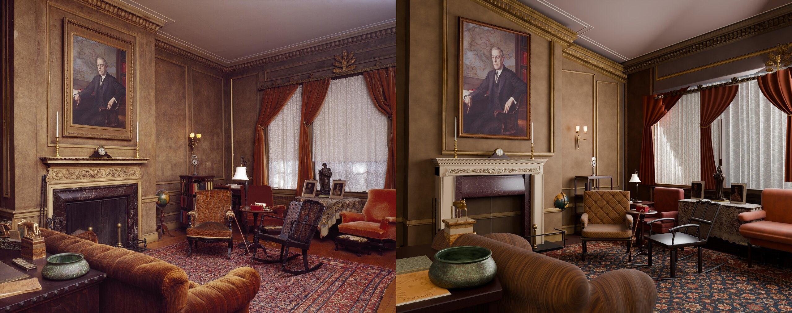

# Photo to Scene

Photo to Scene turns one reference photograph into a staged Blender scene. The workflow moves through a floorplan, neutral blockout, object identification, per-object detail, integration, and materials. A fresh builder and critic handle each stage, while GOTO sends a defect back to the stage that owns it.

The handoffs are files rather than hidden context. Machine-checked spatial contracts carry source evidence, local-to-room frames, footprints, fronts, semantic regions, relationships, ownership, and visible apertures from blockout through the final material render. [The stage reference](docs/STAGES.md) defines the contracts, retry limits, validation gates, and resume behavior.

## Run a reconstruction

Requirements:

- Bash 4 or newer, GNU coreutils, and `jq`
- Nix with `nix-shell` enabled; the workflow uses it to provide Python, Blender, and ImageMagick
- an installed and authenticated Codex CLI
- enough CPU time and disk space for repeated Cycles renders

From the repository root, give the run its own work directory and pass an absolute path to one photograph:

```sh
PHOTO_TO_SCENE_ROOT="$PWD/work" ./pipeline.sh /absolute/path/to/photo.jpg
```

The driver creates the work directory, seeds its generic asset builder, and writes durable state after each attempt. To resume from a particular stage, reuse the same directory and set `PHOTO_TO_SCENE_STAGE`:

```sh
PHOTO_TO_SCENE_ROOT="$PWD/work" \
PHOTO_TO_SCENE_STAGE=integrate \
./pipeline.sh "$PWD/work/input/reference.jpg"
```

The driver copies the input into `input/reference.<extension>` and records its run-relative path in `input.json`. All input-photo `image`, `source_image`, and `reference_image` fields use that path, including nested evidence and per-object entries. Resolve these paths from the run root, not the JSON file’s directory. Every model stage receives the same reference convention. A different photograph is rejected when resuming an existing run.

Move or publish the complete run directory with `input.json` and `input/` intact; resume using the bundled photograph at its new location. The final artifact directory also includes this pair beside the exported contracts, so input-photo references work without rewriting. Legacy contracts with external references are not automatically migrated. Generated Blender scripts and saved scenes may have their own external dependencies; this guarantee covers contract image references.

Valid resume targets are `floorplan`, `blockout`, `identify`, `detail`, `object:<id>`, `integrate`, and `materials`. Set `BOTQ_ARTIFACTS_DIR` to override the final artifact directory.

The main outputs are:

- `work/floorplan.json`: room geometry, camera, fixed features, and scale evidence
- `work/objects.json`: the visible-object inventory and spatial contracts
- `work/assets/<id>.py`: procedural Blender builders for individual objects
- `work/state/*.png`: stage, overlay, object, and final renders
- `work/state/scores.md`: attempt scores, changes, GOTO history, and critic verdicts

## Stages

```text
photo
  ↓
floorplan → blockout → identify → detail per object → integrate → materials
    ↑          ↑                       ↑               ↓          ↓
    └────────────────────── GOTO ─────────────────────┴──────────┘
```

Floorplan establishes the room and camera. Blockout becomes the spatial authority. Identify checks the object inventory and crops. Detail builds and reviews every object independently. Integrate assembles the scene and measures the result against the spatial contracts. Materials adds the shell surfaces, lighting, colour management, and final render without relaxing those contracts.

## Results so far

The first two rows come from runs of the same private evaluation scene; the third is the public [Wilson House example](examples/wilson-house/report.md). “Gate score” is the final machine-gate result, while “critic score” is the last available visual evaluation before a hard gate prevents further criticism.

| Run | Workflow SHA | Gate score | Critic score | Binding stage | What changed |
|---|---|---:|---:|---|---|
| Run 3 | Unversioned run artifact | Pass (legacy envelope gate) | 5/10 | Blockout | Establishes the staged baseline. The legacy gate checks outer axis-aligned bounds but does not preserve directional or internal spatial structure. |
| v4 run 1 | `81defd9544e6f700500cbc37cb3e496960e69e7c` | 0/10 | 5/10 | Materials | Fixes sectional placement and facing, the black far window, and duplicated basket geometry. The stricter materials gate then reports 25 footprint or region contract failures across 20 objects. |
| Wilson House | `428a8fbd94d5dc66d01e975c063a160f22a8f9d1`, continued from `05b4bad57d40f982c0ca4209af511e90c8f2454c` | 0/10 | 7/10 (post-run) | Blockout | Completes 99 detailed objects, integration, materials, and the final render. The observed gate reports 68 contract errors that only blockout can repair, after both GOTO allowances were spent. No scene critic ran inside the run; the materials critic prompt, run once on the final render, scores 7/10. |

The lower v4 gate score reflects stricter measurement rather than a claim of lower visual quality: failures that the earlier envelope proxy accepts now stop the pipeline with concrete object-level errors.

## Known limits

Spatial understanding of large asymmetric furniture remains the open problem. A single photograph can leave handedness, hidden extent, and contact relationships ambiguous; the contracts expose those decisions and catch downstream drift, but they do not guarantee the upstream interpretation is correct.

Model calls time out after 1500 seconds without non-whitespace output or CPU activity. Activity means at least 10 CPU ticks of tree growth per sample, or a live thread observed runnable (Linux `/proc` state `R`, running or waiting for CPU) in at least half the samples across the idle window. Each window counts at most one runnable observation per sample, regardless of tree size; output or CPU growth starts a fresh window. This samples sustained CPU demand so a continuously runnable tool stays active even when starved, while isolated runnable observations from periodic wakers do not reset the idle timer. Brief runnable bursts between samples still rely on CPU growth; sleeping and I/O waits alone do not reset the idle timer. Scheduler wait accounting need not be enabled. The separate wallclock limit still applies.

CPU rendering and per-object review also make a complete run expensive. Visual critic scores remain subjective, and a passing spatial contract does not guarantee photorealistic geometry or materials.

## Example

The [Wilson House worked example](examples/wilson-house/report.md) reconstructs a public-domain Library of Congress photograph end to end: 99 detailed objects, integration, materials, and a final render. The final scene scores 0/10 on the observed spatial-contract gate (68 errors) and 7/10 from the workflow's materials critic, run once on the final render after the gate blocked the in-run critic. A [later rerun](examples/wilson-house/rerun-4/report.md) on the current workflow passes the observed gate with 0 errors, and its in-run materials critic scores 7/10.



## License

Licensed under either the Apache License, Version 2.0, or the MIT License, at your option.
