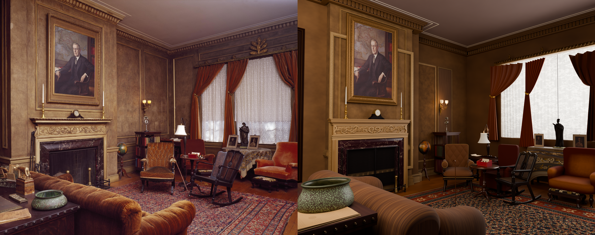
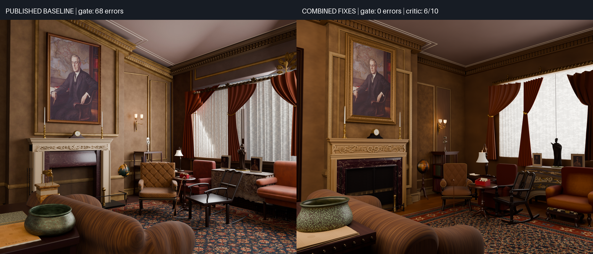

# Wilson House: combined-fixes rerun

The rerun passed the final observed spatial-contract gate with **zero errors**, allowing in-run scene criticism that the baseline's 68 errors had blocked. Integration scored **7/10**; the selected materials candidate scored **6/10**. All **81 detail contracts finalized**, although only 13 reached 8/10. The run used the combined fixes without photograph-specific workflow tuning.

Completion required **supervised finalization**: after saving the materials candidate, the driver accepted an earlier-stage repair despite its expired elapsed budget. That suffix was stopped and the existing final-render stage rendered the saved best scene. Four earlier infrastructure interruptions also required continuations. These qualifications are part of the result, not omitted timing overhead.

[Full final render](renders/final.png) · [Scored attempts and verdicts](scores.md) · [Source attribution](ATTRIBUTION.md) · [Baseline report](../report.md) · [Design and comparison](../../../experiments/wilson-house-combined-fixes/README.md)

## Before and after

| Measure | Published baseline | Combined-fixes rerun |
|---|---|---|
| Workflow | Continued run ending `428a8fb` | Fresh state on `034bebf`; four infrastructure continuations and supervised finalization |
| Final observed spatial gate | 0/10; 68 errors | Pass; zero errors for all 81 assets; footprint-observer caveat below |
| In-run scene critic | Not run: gate blocked | Integration 7/10; selected materials 6/10 |
| Separate post-run critic | 7/10 | Not run |
| Detail objects finalized | 99/99; mean 6.9/10; 33 at least 8 | 81/81; mean 6.67/10; 13 at least 8 |
| Builder GOTO spend by source stage | 5 object; 0 integration/materials | 2 blockout, 3 ceiling detail, 1 reserved integration repair |
| Critic GOTO spend by source stage | 5 tier; 0 integration/materials | 2 tier, 1 materials; final materials redirect stopped over budget |
| Reserved blockout repairs | No reserves in baseline | Integration reserve used; materials reserve unused |
| Refused repairs | 190 at caps; 23 invalid-stage requests separately | 61 at caps; 26 invalid-target requests separately |
| Recorded attempts | 386 | 360 scored records; 370 known sequences including 10 unscored |
| Summed attempt time | 118,534 s (32.9 h) | 99,501 s (27.64 h); excludes unscored work and final rendering |
| Driver-enforced model stops | Not separately derived in published summary | 1: fire-screen attempt 129 reached its 2,100 s bound |
| Final render call | 611 s | 524.74 s Blender; 621 s supervised finalization |
| End-to-end elapsed time | Unavailable; last continuation 8 h 19 min | 122,363 s (33 h 59 min 23 s); includes interruption gaps and supervised finalization |

The baseline's separate 7/10 post-run critic and this run's 6/10 in-run materials critic are not a controlled quality comparison. The baseline used different reasoning effort, workflow revisions, and 99 objects. Timing is also confounded by shared-host contention and interruption gaps.

The selected render retains visible weaknesses: an oversized, left-clipped foreground bowl; undersized or crowded seating; overly bright windows and dark midtones; and rigid curtain folds. A green spatial gate establishes consistency with the saved declarations, not fidelity to the photograph. In particular, the floor declaration was changed to an enclosing rectangle to match an observer that loses concavity (#45), while the actual floor geometry remains L-shaped.

## Method and provenance

The [design](../../../experiments/wilson-house-combined-fixes/README.md) was recorded and landed before execution. The run began with an empty directory on workflow `034bebfdc1b27d7f515052f33e2f7631c89718db`, after the corrected #32 prerequisite was accepted. No prompts, budgets, driver code, or scene assets were manually tuned during measurement. The mesh A/B and layout-oracle experiments were left intact.

The input was the original 6114×4842 Library of Congress photograph, credited in [the example attribution](../ATTRIBUTION.md), SHA-256 `2f51726bfcb4f24445bb301131ad322f278d5f2412bfa4f926f6d602799a735a`. The run used Codex CLI 0.156.0, `gpt-6-astra`, and CPU rendering. Child transcripts report reasoning effort `none`; the baseline used `medium`. Builders selected Blender 4.3.2, 5.0.1, 4.5.3, and later 5.2.2, and recovered library-path launch failures. Those recovery costs remain in the measurement. During upper-shelf book attempt 247, the builder terminated a quiet Blender 5.2.2 call after about 371 seconds and retried with audio disabled; this was a builder-managed recovery, not an outer workflow restart. Similar runtime recovery occurred in attempt 249. During small-tier attempt 265, the builder stopped a 519-second composition call and changed its run-local composer to construct new assets in temporary empty scenes before linking them into the room, avoiding repeated full-scene updates while retaining asset geometry.

This is one stochastic workflow comparison, not an ablation identifying each fix's causal effect. The baseline continued across three revisions and retained a different object inventory. Neither reasoning configuration nor toolchain selection was controlled across the two runs. No synthetic host load was generated and no GPU memory was allocated. A read-only observation during a slow fire-screen render found a load average of 75.22 and CPU pressure of about 91%; the host was shared, so elapsed time is not a controlled throughput benchmark.

## Continuations and accounting

Fresh-state execution started at 2026-10-02 14:32:28 -07:00. It continued four times on the same workflow revision after infrastructure interruptions:

- The first foreground process exited with SIGTERM (143) around 21:15:55, after the large-tier review scored 7/10 and during the ensuing blockout cross-check. No driver timeout was logged. Detail resumed at 21:16:45 with all 27 large objects and existing budgets retained. The repeated tier critic scored the same saved image 8/10; no critic GOTO was spent.
- A host restart at 23:53:23 interrupted the statue's first builder after rendering but before a critic record. Detail resumed at 23:54:32 with 41 finalized objects retained. The normal entry repeated the large-tier review, scoring a newly generated composition image 8/10. The interrupted statue entry has no scored record.

- A third interruption left the candlestick entry 217 unscored. The last transcript write was 2026-10-03 06:15:03 -07:00. On resumption, the host had booted at 11:18:56 and no previous pipeline process remained. Detail resumed at 11:20:33 with 57 finalized objects. The exact stop time before boot is unknown; the five-hour gap must not be presented as measured processing time.

- A fourth infrastructure interruption ended the third continuation with SIGTERM (143), observed at 2026-10-03 18:58:49 -07:00. The medium-tier sequence 284 render had saved and its critic had started, but no verdict was recorded. No driver timeout was logged and no pipeline child remained. The cause is unknown. The saved state retained 78 finalized objects. Detail resumed at 18:59:35 on the same revision, repeating the normal large- and medium-tier reviews before the remaining three objects.

Scored attempt seconds include builders, critics, rendering, and checks within each recorded attempt. They omit builder redirects that return before recording, interrupted unscored work, some post-verdict cross-checking, and the final render call. End-to-end elapsed time includes continuation gaps. These are different measures and are reported separately. Tier reviews do not log ordinary ENTER events, so total known attempt sequences are the union of stage-entry, verdict, and explicitly preserved interrupted-tier sequence identifiers. The ten unscored sequences comprise six builder redirects, three infrastructure interruptions (including tier 284), and the supervised stop of floorplan 370. The first interrupted tier had already recorded its score.

## Composition repairs and reuse

The first critic-directed blockout repair followed medium-tier sequence 147 (7/10) and its blockout cross-check (7/10). The accepted third blockout candidate scored 8/10. It revised 34 contracts: 30 previously finalized objects required rebuilding, four affected small objects had not yet been built, and 24 completed objects remained reusable.

After all 81 objects finalized, small-tier sequence 265 scored 7/10 because the foreground console was largely hidden behind the sofa. Its blockout cross-check scored 8/10; the one-point difference permitted the second critic redirect. Three blockout candidates each scored 7/10, so the workflow retained the first. Identification then scored 8/10. Only ten contracts changed—the console and its contents—and 71 completed objects retained their budgets and assets. Later unselected blockout candidates also adjusted chairs, a table and the sofa, but those changes were not retained.

## Reading the scores

An object marked finalized has either reached 8/10 or exhausted its two permitted attempts under its current contract. It is not necessarily visually correct. The scene's spatial gate and its visual critic are reported separately; a blocked critic has no in-run score. In particular, the hidden-wall visual zeros were critic judgments against inappropriate photographic crops, whereas the declaration and freshness failures were machine-gate rejections.

The observed 2,100-second wall-clock stop during fire-screen attempt 129 was a model-call failure, not a visual score. Its retry completed and scored 7/10. Infrastructure interruptions are also distinct from this driver-enforced stop.

The external-child critic conflict recurred in desk-rack sequence 275: the critic requested books, cards and envelopes even though the contract assigns its children externally. Attempt 276 requested a blockout repair, first with the invalid redirect schema and then with a valid request refused at the exhausted builder cap. It subsequently preserved external ownership and refined only the rack. These are recurrences of #36 and #39, not additional independent defects.

## First integration repair

After the second layout repair and continuation reviews, the complete composition scored 8/10 at sequence 293. First integration sequence 294 then measured 70 spatial errors. The builder requested blockout reconciliation, and its reserved integration repair was accepted as builder redirect six. Because this redirect precedes the driver's record step, sequence 294 has no scored ledger row; the saved validation records the 70 failures.

One failure is a measurement defect filed as #45: the integration observer reports an enclosing rectangle for the correctly L-shaped floor. The measured main and rear-recess regions match the declared geometry, but the rectangular observation adds the empty corner strip. This does not invalidate all 70 errors; other assets have genuine measured dimension or region discrepancies. The integration render and overlay were viewed and preserved before repair.

Blockout candidate 295 scored 8/10 and its declaration and observed checks both reported zero errors for all 81 objects. The candidate changed 34 contracts, leaving 47 completed objects reusable. This gate success does not resolve #45: the floor declaration became the observer's enclosing rectangle while its main/recess geometry remained L-shaped. The report therefore distinguishes a green observed gate from proof of a faithful footprint representation. The candidate also corrected physical region construction and support declarations elsewhere.

During large-tier review 329, the builder terminated a slow composition process that had stopped advancing its log after W4, then changed its run-local composer to build each asset in a temporary empty scene before linking it into the room. This mirrors the earlier small-tier 265 recovery and preserves accepted assets and camera. It is a builder-managed in-attempt recovery, not an outer workflow restart; its cost remains in the tier record.

## Integration after rebuilding

The large-, medium-, and small-tier compositions each scored 8/10 at sequences 329, 363, and 365. All 81 current contracts finalized before integration resumed. Sequence 366 initially reported 13 observed region mismatches: three wall regions and ten cornice regions. Its blockout request was refused because the integration reserve had already been used. The builder then removed wall and cornice overrides and duplicate wall decoration, rebuilding against the existing contracts. The observed gate reached zero errors and the in-run integration critic scored 7/10. Both the 13-error render and the passing render were viewed and preserved.

Integration sequences 367 and 368 also scored 7/10. Remaining corrections included the oversized foreground bowl, narrow rocking chair, wall-panel height, and the window-side grouping. Builder requests for contract reconciliation were refused at the exhausted cap. The final integration critic then emitted `object:foreground_bowl`, an ID absent from the inventory (`bowl` is the actual ID). The driver rejected that critic route, and the exhausted integration loop advanced to materials. This new routing defect is filed as [#46](https://github.com/bddap-bot/photo-to-scene/issues/46); it consumed no critic GOTO. Scene-critic feedback and machine-gate success therefore remain separate outcomes.

## Materials and supervised budget finalization

Materials sequence 369 passed the observed spatial gate with zero errors but scored 6/10. The critic identified camera/framing differences, crowded seating, nearly white windows, dark midtones, and rigid curtain folds. Its first correction requested floorplan repair. The driver accepted critic redirect three at 2026-10-04 00:17:35 -07:00, 17,075 seconds after the integration timer began, despite the configured 12,600-second elapsed budget and a saved best materials scene.

The budget check only runs when the current stage is integration or materials. The floorplan redirect therefore bypassed it and began sequence 370, exposing [#47](https://github.com/bddap-bot/photo-to-scene/issues/47). This work could not improve the saved candidate: returning to integration would encounter the expired budget and finalize immediately. The worker stopped this over-budget suffix at 00:20:28, with exit 143, and observed all six pipeline processes terminate without forced killing. Sequence 370 is unscored. Its tentative floorplan was archived separately, then the metadata matching materials 369 was restored. The object inventory was unchanged.

Final rendering used the existing final-builder prompt, model-call machinery, and publication tail against `best_materials.blend`, without changing its saved scene, score, or the workflow's budgets. This is **supervised finalization of the saved best candidate**, not a normal end-to-end driver exit. It is separate from the four infrastructure interruptions. The saved materials score remains 6/10; no post-run critic replaces it.

The final-render model wrapper was separately interrupted with SIGTERM (143), observed at 00:29:40, after its last output at 00:28:51. Its Blender child survived. The worker waited for that child to finish all 256 samples, then ran the already-prepared comparison helper and publication tail. Blender logged `Finished`, saved the image, and quit; its exit status was unavailable after its parent was interrupted. Image dimensions and the completed output were verified independently. No second render or scene revision was made. This fifth infrastructure interruption affected finalization, not the four earlier pipeline continuations.

Final publication completed at 2026-10-04 00:31:51 -07:00. The supervised finalization interval was 621 seconds, including the wrapper interruption and recovery. Blender's render log reports 524.74 seconds. End-to-end elapsed time from the fresh start was 122,363 seconds (33 h 59 min 23 s), including all gaps; it is not a measure of uninterrupted processing time.

## What the fixes demonstrated

- The reserved integration repair was available after all five ordinary builder redirects were spent. It led to contract reconciliation and rebuilding, followed by a zero-error integration gate after local assembly corrections.
- The two tier-directed composition repairs received fresh cross-checks. No tier non-verdict consumed a redirect in this run. Unchanged contracts retained completed work: 24, 71, and 47 objects survived the three accepted spatial revisions described above.
- Annotation-only reuse remains incomplete: appearance handoff metadata still reset a ceiling budget (#37). Passing declaration checks also did not prevent stale free-form appearance constraints (#44).
- Published photograph references remain run-relative without path rewriting. The full-resolution input is copied unchanged; its checksum and nested references were verified.
- Natural CPU contention was observed without synthetic load. One model call hit its wall-clock bound; no idle stop was recorded. This is operational evidence, not a controlled proof of either liveness implementation.

## Newly exposed workflow defects

This run filed [#35](https://github.com/bddap-bot/photo-to-scene/issues/35) through [#47](https://github.com/bddap-bot/photo-to-scene/issues/47), each separately. The [design's defect list](../../../experiments/wilson-house-combined-fixes/README.md#defects-observed-during-execution) describes the evidence: malformed inventory handling, critic ownership conflicts, annotation-driven invalidation, missing redirect accounting, malformed builder redirects, unrelated hidden-object crops, stale texture restoration, inconsistent preview proportions, duplicated ownership after relabeling, stale appearance dimensions, concave-footprint observation, invented critic IDs, and late budget enforcement.

These were recorded without patching the measured workflow. A low score is retained as the capped outcome.

## Published evidence

The directory retains the original photograph and input metadata, final `floorplan.json` and `objects.json`, observed spatial measurements and gate result, selected critic verdict, render settings, and the scored-attempt report. The final render uses the saved materials scene at 1920×1521, Cycles CPU, 256 samples, and denoising. The source aspect ratio is preserved. Every published render and comparison was viewed before landing.

The full execution transcripts, unscored-attempt evidence, scripts, selected scene, asset textures, contracts, and verdicts are retained with the run's external artifact archive. Runtime installations and caches are omitted. Raw transcripts are not repository documentation.
