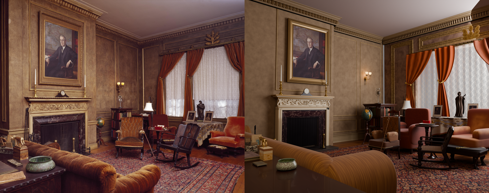
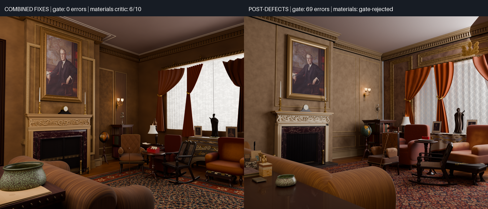

# Wilson House: post-defects rerun

The rerun **completed with a normal driver exit and no supervised finalization**: no infrastructure interruption, no manual step and no workflow change between the empty run directory and `COMPLETE`. All **68 detail assets were built**: all 66 observed objects finalized with mean best score **7.29/10**, 28 at least 8, and two inferred structures were built unscored.

The scene **failed the observed spatial gate**. Integration ended at 20 errors on each of its three attempts. Materials then measured **69 errors**, because it received a stale assembly (#54). No in-run scene critic ran, so there is no integration or materials score to compare with the combined-fixes run's 7/10 and 6/10.

[Full final render](renders/final.png) · [Scored attempts and verdicts](scores.md) · [Source attribution](ATTRIBUTION.md) · [Combined-fixes report](../combined-fixes/report.md) · [Design and comparison](../../../experiments/wilson-house-post-defects/README.md)

## Before and after

Both runs used `gpt-6-astra` at reasoning effort `none`, so model configuration is not a confound in this comparison. All 587 model calls in this run reported effort `none`.

| Measure | Combined-fixes run | Post-defects rerun |
|---|---|---|
| Workflow | Fresh state on `034bebf`; four infrastructure continuations and supervised finalization | Fresh state on `4d84583`; one continuous run, normal driver exit |
| Final observed spatial gate | Pass; zero errors for all 81 assets | Fail; 69 errors at materials on a stale assembly (#54); integration 20 errors on each attempt |
| In-run scene critic | Integration 7/10; selected materials 6/10 | None: integration and materials were gate-rejected |
| Tier composition reviews | Not separately tabulated | 14 records: large 6, 6, 6, 6, 7; medium 6, 6, 6, 6, 7 and one provider failure; small 6, 7, 7 |
| Detail objects finalized | 81/81; mean 6.67/10; 13 at least 8 | 66/66 observed; mean 7.29/10; 28 at least 8; plus 2 inferred, unscored |
| Builder GOTO spend by source stage | 2 blockout, 3 ceiling detail, 1 reserved integration repair | 4 detail to blockout, 1 blockout forward hand-off (#53), reserved integration and materials repairs |
| Critic GOTO spend by source stage | 2 tier, 1 materials; final materials redirect stopped over budget | 5 tier reviews to objects, each resuming detail (#51 fix) |
| Reserved blockout repairs | Integration reserve used; materials reserve unused | Both used |
| Refused repairs | 61 at caps; 26 invalid-target requests separately | 52 at caps (44 builder, 8 critic within tiers); 0 invalid targets; 0 critic route rejections |
| Recorded attempts | 360 scored records; 370 known sequences including 10 unscored | 270 scored, 2 inferred and 7 redirect records; 279 known sequences, none unrecorded |
| Summed attempt time | 99,501 s (27.64 h); excludes unscored work and final rendering | 54,729 s scored + 189 s inferred + 972 s redirected = 55,890 s (15.53 h) |
| Model-call tokens | Not derived | 14,799,395 |
| Driver-enforced model stops | 1: fire-screen attempt 129 reached its 2,100 s bound | 0; 3 calls failed because the provider reported the model at capacity |
| Final render call | 524.74 s Blender; 621 s supervised finalization | 583 s Blender; 668 s from saved materials scene to `COMPLETE` |
| End-to-end elapsed time | 122,363 s (33 h 59 min 23 s); includes interruption gaps and supervised finalization | 56,613 s (15 h 43 min 33 s); no gaps |

This is one stochastic run per workflow, not a per-fix ablation. The inventories differ, at 81 and 68 objects, and visual critic scores are subjective. The two final scenes are not directly comparable on a critic score, because this run never reached an in-run scene critic.

The render keeps the room's layout, the fireplace wall, the window bay, the seating group and the foreground sofa. Its visible weaknesses are: an oversized foreground sofa turned diagonally across the view; a missing ceiling-to-wall join at the top right; a curtain clipped at the right edge; strong banding in the ceiling and upholstery shading; and a wider, higher camera than the photograph's. The gate failures name real disagreements, not only stale ones: furniture footprints and regions, a window opening the north wall asset never tagged, and document-rack shelves it never tagged.

## Method and provenance

The [design](../../../experiments/wilson-house-post-defects/README.md) was landed before execution. A first run on `af4f3d5` exposed #51 and #52 and was halted at integration. This second run began from an empty directory on `4d845833df4e084af59ff46f4fdf8c1647ddc6db`, which adds only those two fixes. The workflow ran from an exported tree of that revision. No prompts, budgets, driver code or scene assets were changed.

The input was the original 6114×4842 Library of Congress photograph, credited in [the example attribution](../ATTRIBUTION.md), SHA-256 `2f51726bfcb4f24445bb301131ad322f278d5f2412bfa4f926f6d602799a735a`. The run used Codex CLI 0.156.0 and `gpt-6-astra` at reasoning effort `none`, matching the combined-fixes run. Rendering used Cycles on the CPU, the pipeline's default; the final builder selected no device. The final image is 1920×1521, 256 adaptive samples, denoised.

Three model calls (tier review 112, wall sconce 120, foreground tray 144) failed because the provider reported the model at capacity. The driver recorded each as a model failure scoring 0 and continued. These are not visual verdicts.

## Per-stage time and tokens

Identification re-ran after each blockout reentry; its six passes are shown separately here rather than folded into detail. Tokens are summed from each call's reported total. Tier reviews have no stage-entry line, so their tokens fall under detail.

| Stage | Scored records | Scored seconds | Redirect seconds | Tokens |
|---|---:|---:|---:|---:|
| Floorplan | 3 | 675 | 0 | 159,884 |
| Blockout | 18 | 7,016 | 150 | 1,660,720 |
| Identify | 6 | 991 | 0 | 361,801 |
| Detail | 227 | 40,669 | 239 | 12,281,464 (with tier reviews) |
| Tier reviews | 14 | 3,657 | 0 | in detail |
| Integration | 3 | 1,407 | 508 | 313,887 |
| Materials | 1 | 503 | 75 | 21,639 |

## What the fixes demonstrated

| Fix | Observed in this run |
|---|---|
| #35, #49 | No validator crash, and no blockout declaration was rejected. |
| #36, #43 | None of the four detail-to-blockout builder GOTOs came from a neighbour-ownership claim. All four were facing errors in the contracts (west wall, north wall, north and west cornices), filed as #55. |
| #37, #44 | Not separately measured. Contract hashes changed only after accepted blockout repairs. |
| #38 | All seven builder redirects are recorded with their seconds; every known sequence has a record. |
| #39, #46 | No invalid GOTO target and no rejected critic route. |
| #40 | Two inferred walls were built from their contracts without crops or critics and reported unscored. |
| #41 | Not separately audited. |
| #42, #45, #52 | One driver tool placed and measured every asset. Every observed gate completed without an out-of-memory kill. The run's memory peak through the first integration gate was 5.5 GB; the first run's gate had exceeded 23 GB resident plus 10 GB swap. |
| #47, #48 | The run ended with a normal driver exit and needed no supervised finalization. The stage 5/6 cap started at the first integration entry, but it can finalize only a saved materials scene. None existed until the last materials attempt, so the materials reserve launched upstream repair work about 16,300 s into the 12,600 s budget. |
| #51 | Each of the five tier-to-object critic GOTOs resumed detail. Every tier review then ran and all 68 assets were built before integration. |

## Newly exposed workflow defects

The first run filed [#51](https://github.com/bddap-bot/photo-to-scene/issues/51) and [#52](https://github.com/bddap-bot/photo-to-scene/issues/52); both were fixed before this run. This run exposed three more, each filed separately:

- [#53](https://github.com/bddap-bot/photo-to-scene/issues/53): builders spend repair GOTOs on forward hand-offs. At sequence 34 the blockout builder finished a requested repair, then routed to `object:north_cornice`. The driver accepted that as builder GOTO 4, skipping the blockout critic, candidate selection and identification. Four more such hand-offs (to `detail`, `integrate` and an object) were refused at the cap and counted among the 44 builder refusals.
- [#55](https://github.com/bddap-bot/photo-to-scene/issues/55): blockout facing is never checked against the room. Walls, cornices, baseboards, the pelmet, the sconce and the clock were declared facing world +Y regardless of their wall. Builder GOTOs 1, 2, 3 and 5 went to facing repairs, and about ten later facing requests were refused at the cap.
- [#54](https://github.com/bddap-bot/photo-to-scene/issues/54): integration skips its attempts after an upstream repair. After the materials reserve repair and the detail rebuild it triggered, `run_integrate` found three earlier records and ran no attempt. It restored the assembly built from the previous contracts, and materials measured that stale scene at 69 errors. This defect determines the final gate result.

## Published evidence

The directory retains the original photograph and input metadata; final `floorplan.json` and `objects.json`; the observed spatial measurement and gate result; the materials verdict; the render settings; derived measurements; and the scored-attempt report. Every published render and comparison was viewed before landing. The full execution transcripts, attempt records, scripts, selected scene, textures and the first run's evidence are kept in the run archive. Raw transcripts are not repository documentation.
