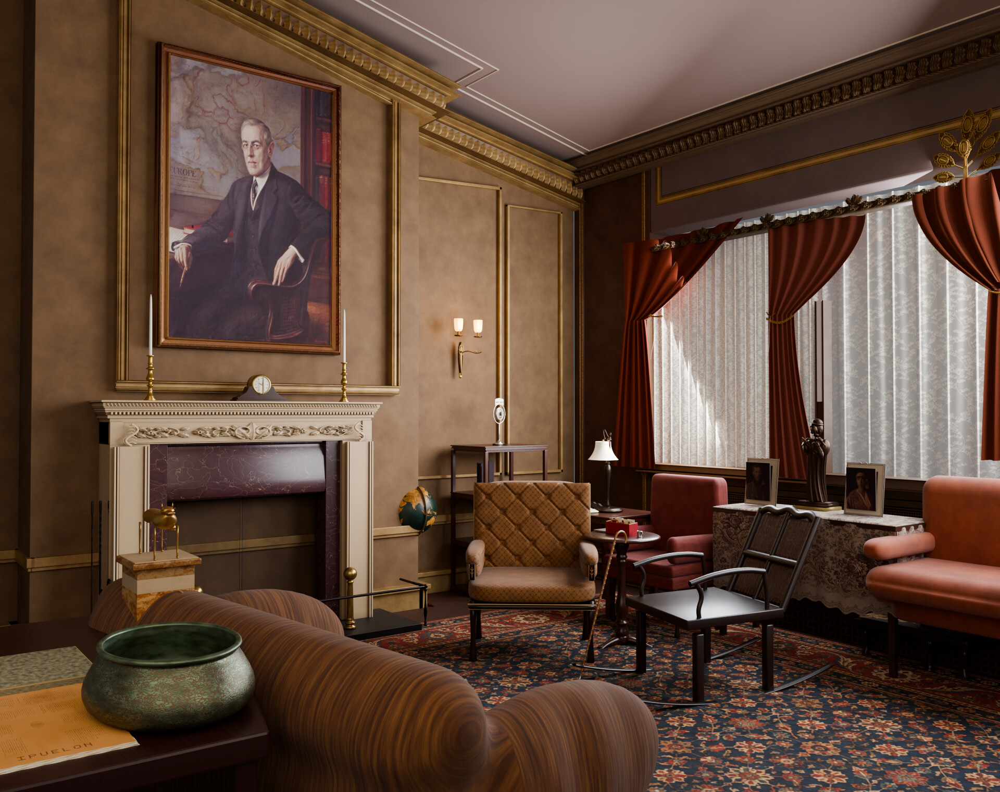
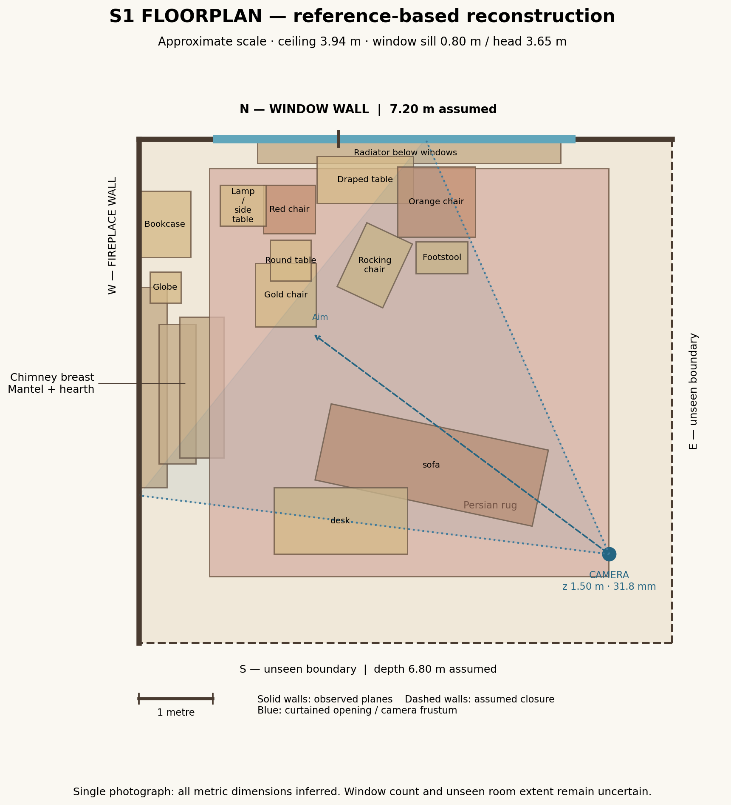
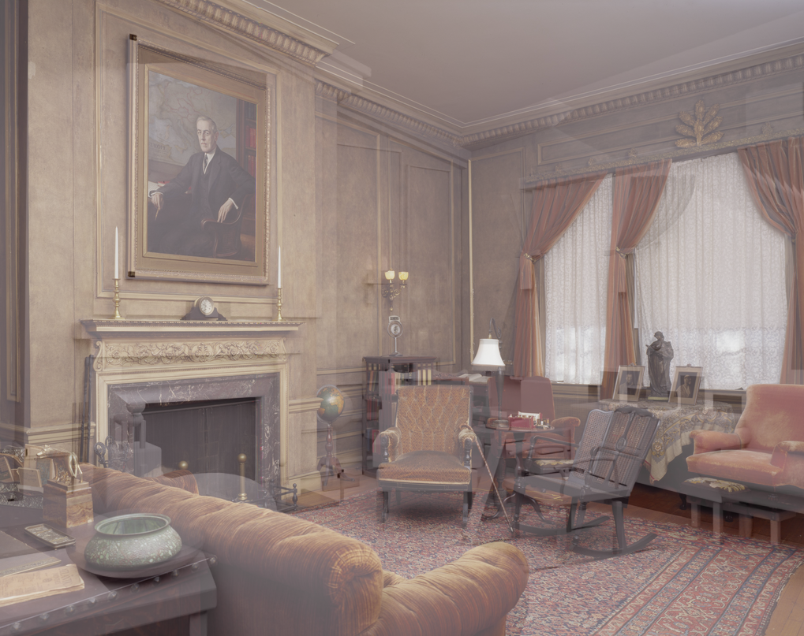
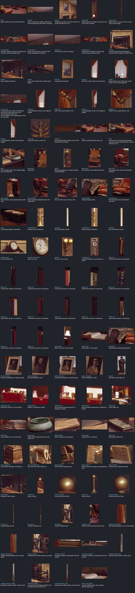
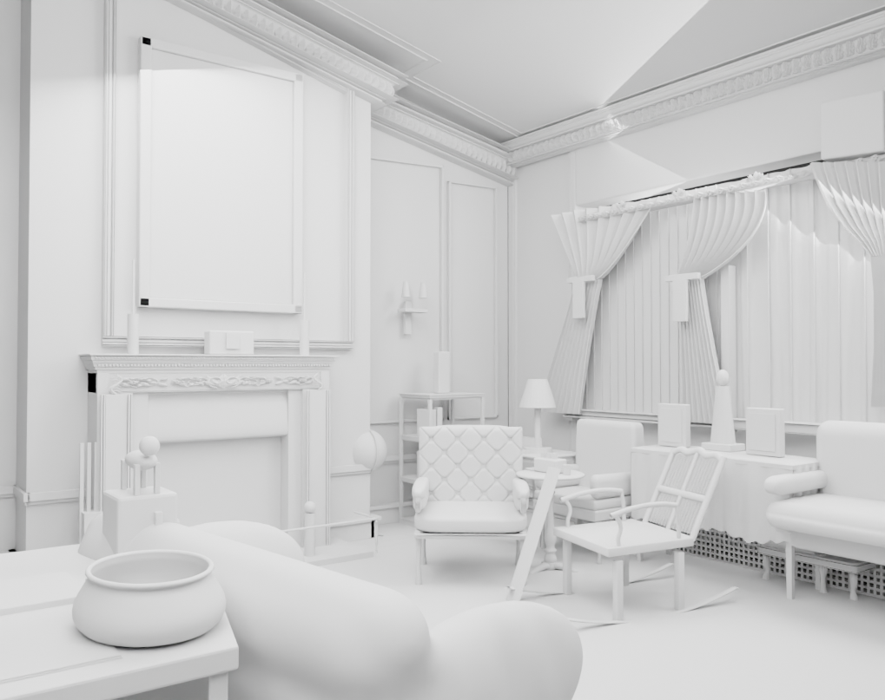
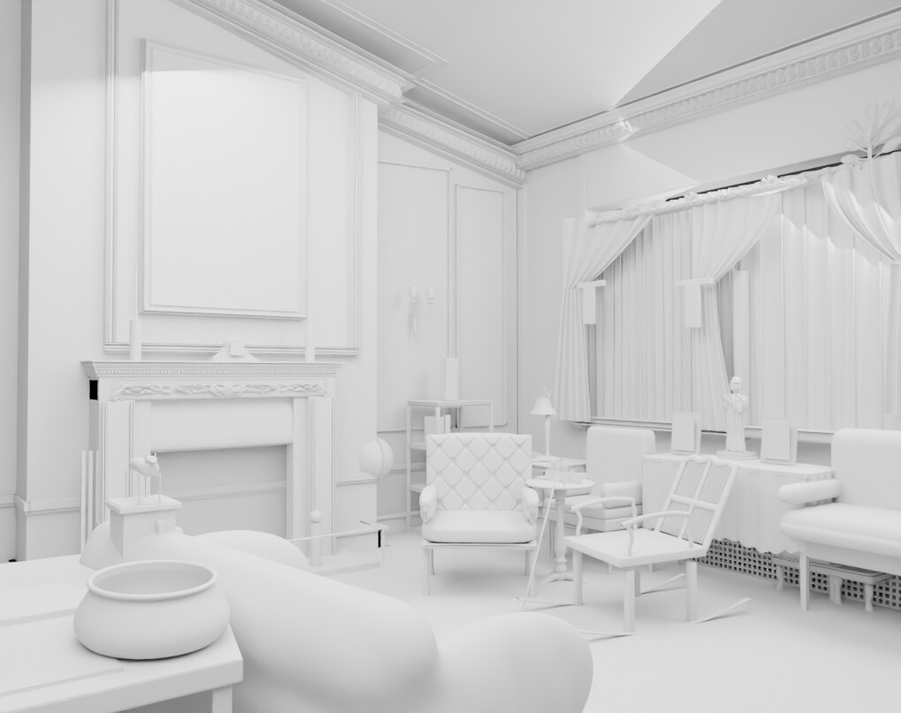
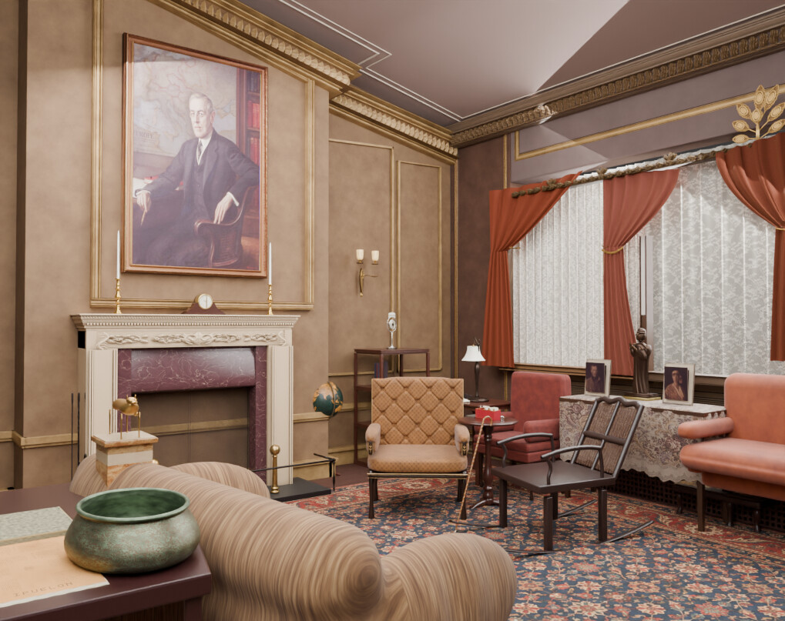
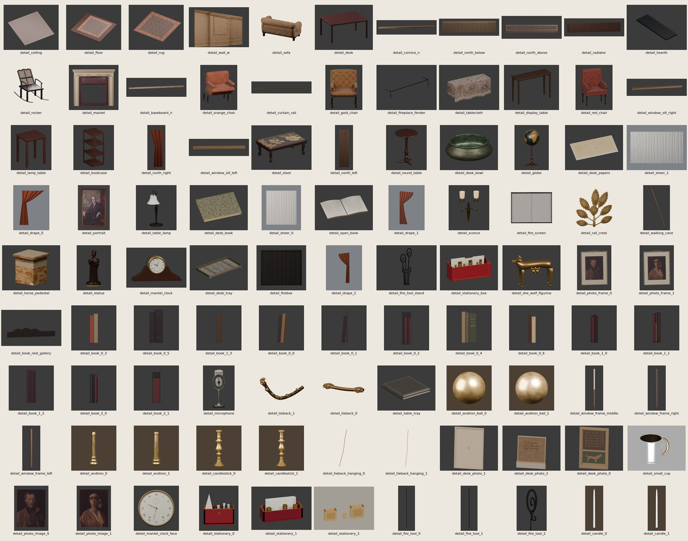

# Wilson House worked example

The [combined-fixes rerun](combined-fixes/report.md) is published separately: 81/81 contracts finalized, zero final observed errors, and a 6/10 in-run materials score. It required supervised finalization after an expired-budget redirect. The original baseline below is preserved.

The [post-defects rerun](post-defects/report.md) is published separately: all 68 assets built, mean detail score 7.29 over 66 observed objects, and a normal driver exit with no supervised finalization. It failed the observed gate (20 errors at integration, 69 at materials on a stale assembly), so no in-run scene critic ran.

The [third rerun](rerun-3/report.md) is published separately: all 67 assets built, mean detail score 7.46 over 65 observed objects, and a normal driver exit with no supervised finalization after one infrastructure continuation. It failed the observed gate on 3 asset-geometry errors at both integration and materials, so no in-run scene critic ran.

The [fourth rerun](rerun-4/report.md) is published separately: the first to pass the observed spatial gate, with 0 errors at integration and materials, so the in-run scene critics ran and materials scored 7/10. All 83 assets were built, with a mean detail score of 7.48 over 77 observed objects, and the driver exited normally with no supervised finalization.

The workflow reconstructed the Library of Congress photograph of the Woodrow Wilson House living room end to end: 99 detailed objects, integration, materials, and a final Cycles render. The final scene failed the observed spatial-contract gate with 68 errors, so no scene-level critic ran inside the run. The workflow's own materials critic, run once on the final render afterwards, scored it 7/10.

| Measure | Result |
|---|---|
| Final scene gate | 0/10: 68 observed spatial-contract errors after integration and again after materials |
| Scene critic in the run | Not run; the gate rejected both integration and materials first |
| Post-run materials critic | 7/10; first correction assigned to `blockout` |
| Detail objects | 99 of 99 finalized; best scores average 6.9/10, 33 objects at 8/10 or above |
| Recorded attempts | 386, with 32.9 hours of attempt time |

## Design of the run

### Input

The reference is the Library of Congress photograph of the Woodrow Wilson House living room; [ATTRIBUTION.md](ATTRIBUTION.md) gives the credit, rights statement, and full-resolution link. The pipeline received the 6114×4842 full-resolution JPEG without downscaling. The repository keeps a 1529×1211 copy as [source.jpg](source.jpg). The builders recorded the input by absolute path in the contracts; the published [objects.json](objects.json) and [floorplan.json](floorplan.json) name it by file name instead ([#29](https://github.com/bddap-bot/photo-to-scene/issues/29)).

### Workflow and model

The run passes through floorplan, blockout, identify, per-object detail in three footprint tiers with a composition review after each tier, integrate, materials, and a final render; [the stage reference](../../docs/STAGES.md) defines the contracts and gates. Every builder and critic call ran through Codex CLI 0.156.0 with `gpt-6-astra` at medium reasoning effort. Blender rendered on the CPU with Cycles.

The run began in an empty work directory on `05b4bad57d40f982c0ca4209af511e90c8f2454c`. It continued on `ed4bc7e691ec081840040e3acc7918af97c712b5`, which added the footprint tiers, whole-photo detail context, identification review, and separate builder and critic GOTO allowances, and finished on `428a8fbd94d5dc66d01e975c063a160f22a8f9d1`, which bounds every model call. Contracts, attempt records, and assets carried across these revisions, so the example measures one continued run across workflow revisions rather than a fresh run of a single revision. Prompts, driver, contracts, and budgets were not tuned to the photograph.

### Budgets and measures

- Floorplan, blockout, and integrate allow three attempts; identify and each object allow two; materials allows one per entry. A tier review retries once after a failed model call. A score of 8/10 passes; otherwise the best attempt stands.
- Builders and critics each have five GOTOs. Every GOTO taken in this run returned to blockout, the sole spatial authority.
- Model calls are bounded at 2100 s, 4800 s for the final render, and 1500 s without output or a busy child process.
- A gate score of 10/10 means the driver's machine checks passed and 0/10 means they rejected the attempt; a critic score is a fresh visual verdict against the photograph. The final scene gate is the observed spatial-contract gate after materials, and the scene critic runs only when that gate passes.

### Continuation history

After 41 objects were finalized, a blockout GOTO that only added region confidence changed every contract hash and restarted detail at 0/99 ([#21](https://github.com/bddap-bot/photo-to-scene/issues/21)). Tier-review non-verdicts then spent critic GOTOs on full blockout re-entries ([#23](https://github.com/bddap-bot/photo-to-scene/issues/23)), and unbounded model calls held the run for hours on degenerate output streams until it stopped ([#22](https://github.com/bddap-bot/photo-to-scene/issues/22)). The run resumed on `428a8fb` from its recorded attempts and ran to completion.

## Results

### Final scene

The final render holds the room's layout and most of its furnishings: the portrait over the mantel, the carved mantel and marble surround, the window wall with drapes and sheers, the seating group, the rug, the desk bowl, and the sofa in the foreground. The observed spatial-contract gate measured 68 errors after integration and the same 68 after materials: 36 footprints and 26 region extents that did not round-trip, four objects declared floor-supported whose frames sit above the floor (`mantel_clock_face` and three fire tools), and two support relationships without region identifiers (`sofa` and `orange_chair`). Blockout accepted those contradictory supports at declaration time ([#27](https://github.com/bddap-bot/photo-to-scene/issues/27)). All three integration attempts and the materials attempt requested a blockout repair, and each request was refused because both GOTO allowances were already spent ([#26](https://github.com/bddap-bot/photo-to-scene/issues/26)).

The post-run critic reading is not part of the driver's record. After the gate blocked the scene critic, the workflow's `materials_critic.md` prompt and verdict schema were run once against the full-resolution photograph and the final render:

> **7/10.** The render captures the room’s architecture, furnishings, and overall composition well. Similarity is reduced by altered furniture silhouettes, an oversized portrait image, a dark rug with incorrect pattern scale, and lighting that is harder and more synthetic than the photograph.
>
> - GOTO blockout: Match the furniture silhouettes and scale: restore the foreground rocking chair’s curved runners and woven seat, soften the central armchair’s rigid rectangular back, and add the low footstool beneath the right orange chair.
> - GOTO materials: Make the rug predominantly red with finer, denser motifs and the reference’s clearly defined borders; reduce the glossy, plastic appearance of upholstery and marble.
> - GOTO integrate: Widen the portrait’s ornate gold frame and shrink its image area while retaining its outer placement. Soften window illumination and strong architectural shadows to reproduce the photograph’s muted, warm light.

### Stages

| Stage | Attempts | Gate rejections | Stopped model calls | Best critic score | Attempt hours |
|---|---:|---:|---:|---:|---:|
| floorplan | 3 | — | 0 | 7/10 | 0.3 |
| blockout | 30 | 0 | 0 | 8/10 | 2.1 |
| identify | 11 | — | 0 | 10/10 | 0.6 |
| detail, per object | 325 | 30 | 0 | 9/10 | 15.6 |
| tier review | 13 | — | 5 | 2/10 | 13.8 |
| integrate | 3 | 3 | 0 | — | 0.4 |
| materials | 1 | 1 | 0 | — | 0.2 |

Blockout and identify ran several times because GOTOs returned the run to blockout. Every attempt, with its correction context and verdict, is in [scores.md](scores.md).

| Floorplan | Blockout overlay | Identification sheet |
|---|---|---|
|  |  |  |

| Large-tier composition | Medium-tier composition | Integration |
|---|---|---|
|  |  |  |

### Detail objects

All 99 objects finalized under the current contracts. The best recorded scores are 3/10 for two objects, 4 for four, 5 for seven, 6 for fourteen, 7 for thirty-nine, 8 for thirty-two, and 9 for one. The large tier averages 6.4/10 with 6 objects at 8 or above; the medium tier averages 7.2 with 14; the small tier averages 7.0 with 13. Across the run, 30 detail attempts failed the asset or identification check before criticism.

### Tier reviews

Two of the 13 tier-review records carry a usable verdict, both large-tier reviews before the model-call bounds: 0/10 and 2/10, whose blockout corrections the run took as critic GOTOs 1 and 5. The rest are non-verdicts or stalled calls. Six large-tier reviews before the bounds ran between 66 and 188 minutes each, and none of them changed a file in the work directory after its first three minutes. On `428a8fb`, five of the six review calls went silent and were stopped at the idle bound, and the one completed medium-tier verdict scored 0/10 with an empty summary ([#28](https://github.com/bddap-bot/photo-to-scene/issues/28)). The run continued past each failed review as the driver specifies.

### GOTOs

Ten GOTOs were taken, all to blockout:

- Builder 1–5, all from `object:wall_w`: a facing conflict in its frame, then four requests to reshape the chimney panel, trim, and projection beyond the declared regions.
- Critic 1: reduce the foreground table's rightward extent.
- Critic 2–4: tier-review non-verdicts ("the comparison needs to be rerun", a bare `blockout`, "retry the composition comparison").
- Critic 5: lower the ceiling corner and curtain header in image space.

After that, 190 requests were refused at the caps, including every integration and materials request, and 23 named no valid stage. The complete history is in [scores.md](scores.md#goto-history).

### Cost

Recorded attempt time is 118,534 s (32.9 h) across 386 attempts; it includes model calls, rendering, and checks, and excludes pauses between continuations. The final render call took 611 s. The last continuation, on `428a8fb`, recorded 123 attempts and ran 8 h 19 min of wall-clock time with 299 Codex calls: 160 detail builders, 113 detail critics, 10 tier builders, 6 tier critics, 7 integrate builders, 2 materials builders, and 1 final render builder.

Earlier continuations kept no complete call-level trace. Their builder counts are lower bounds reconstructed from stage entries and capped reentry logs, and the critic counts are saved non-gate verdicts:

| Stage | Builder starts and reentries, lower bound | Saved critic calls | Counted calls in the second continuation |
|---|---:|---:|---:|
| blockout | 33 | 30 | 24 |
| floorplan | 3 | 3 | 0 |
| identify | 11 | 11 | 10 |
| object | 371 | 182 | 402 |
| tier | 0 | 7 | 20 |

The counted column overlaps the other two. Currency cost is not available in the retained logs.

### Defects

- [#16](https://github.com/bddap-bot/photo-to-scene/issues/16): an invalid builder GOTO consumed an attempt; fixed by `694f71fce48367189899d6b9dd01d0d36598cfda`.
- [#17](https://github.com/bddap-bot/photo-to-scene/issues/17): a capped builder GOTO retried indefinitely; fixed by `2a85afd92f627a329f0b31f1c8094c8c1141399d`.
- [#18](https://github.com/bddap-bot/photo-to-scene/issues/18): composed local texture paths failed the asset gate; fixed by `5e18e863f0fd67824bda9e92c27a653453fee59d`.
- [#19](https://github.com/bddap-bot/photo-to-scene/issues/19): dense inline contracts exceeded the request limit; fixed by `24504f7b57edae4bfa540b37242744ecf0ce3661`.
- [#20](https://github.com/bddap-bot/photo-to-scene/issues/20): the stage guide still described a global five-GOTO allowance.
- [#21](https://github.com/bddap-bot/photo-to-scene/issues/21): a blockout GOTO that only added region confidence changed every contract hash and discarded 41 finalized objects.
- [#22](https://github.com/bddap-bot/photo-to-scene/issues/22): unbounded model calls held the run on degenerate streams; fixed by `298d17d670240fbec34021a74b32678f10e3c5e2` and `428a8fbd94d5dc66d01e975c063a160f22a8f9d1`.
- [#23](https://github.com/bddap-bot/photo-to-scene/issues/23): tier-review non-verdicts consumed critic GOTOs and triggered full blockout re-entries.
- [#26](https://github.com/bddap-bot/photo-to-scene/issues/26): both GOTO allowances were spent before integration, so its spatial-contract failures could not reach blockout.
- [#27](https://github.com/bddap-bot/photo-to-scene/issues/27): blockout's declaration check accepted `supported_by` relationships its own frames violate.
- [#28](https://github.com/bddap-bot/photo-to-scene/issues/28): tier-review critic calls stalled until the idle bound stopped them.
- [#29](https://github.com/bddap-bot/photo-to-scene/issues/29): contracts record the input photograph by absolute path.

## Artifacts

The contracts are [floorplan.json](floorplan.json) and [objects.json](objects.json). Stage images are in [renders/](renders/), and every attempt, verdict, and GOTO is in [scores.md](scores.md). [PROGRESS.md](PROGRESS.md) records the final state of the run. Blender scenes and textures are not included.
