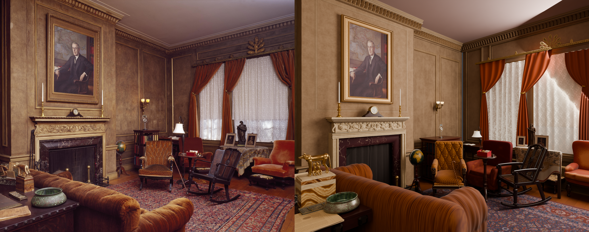
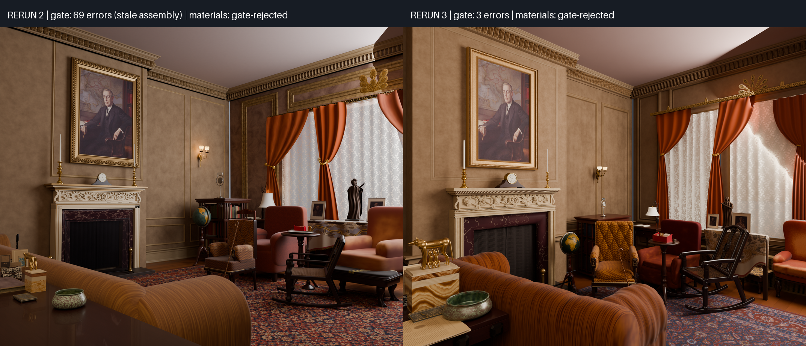

# Wilson House: third rerun

The run **completed with a normal driver exit and no supervised finalization**. One infrastructure interruption occurred: the run was stopped during detail and resumed at `detail` on the same tree in under a minute. All **67 detail assets were built**. The 65 observed objects all finalized, with mean best score **7.46/10** and 34 at 8 or above. The two inferred structures were built unscored.

The scene **failed the observed spatial gate on 3 errors**, against rerun 2's 69. Integration produced the same three errors on all nine of its attempts across three entries, and materials measured them again on the assembly it actually received. The errors are asset geometry that detail accepted: the rocker's footprint and `open_back` region, and the fire tools' footprint ([#58](https://github.com/bddap-bot/photo-to-scene/issues/58)). As in rerun 2, no in-run scene critic ran, because every integration and materials attempt was gate-rejected.

[Full final render](renders/final.png) · [Scored attempts and verdicts](scores.md) · [Source attribution](ATTRIBUTION.md) · [Rerun 2 report](../post-defects/report.md) · [Design and comparison](../../../experiments/wilson-house-rerun-3/README.md)

## Before and after

Both runs used `gpt-6-astra` at reasoning effort `none`, so model configuration is not a confound. All 769 model calls in this run reported that model and effort `none`.

| Measure | Rerun 2 | Rerun 3 |
|---|---|---|
| Workflow | Fresh state on `4d84583`; one continuous run; normal driver exit | Fresh state on `f5ca045`; one continuation at `detail` after an infrastructure stop; normal driver exit |
| Final observed spatial gate | Fail; 69 errors at materials on a stale assembly (#54); integration 20 errors on each of 3 attempts | Fail; 3 errors at materials on the current assembly; integration 3 errors on each of 9 attempts |
| In-run scene critic | None: gate-rejected | None: gate-rejected |
| Tier composition reviews | 14 records: large 6, 6, 6, 6, 7; medium 6, 6, 6, 6, 7 and one provider failure; small 6, 7, 7 | 16 records: large 7 (nine times); medium 7 (four times); small 8, 7, 7 |
| Detail objects finalized | 66/66 observed; mean 7.29/10; 28 at least 8; plus 2 inferred | 65/65 observed; mean 7.46/10; 34 at least 8; plus 2 inferred |
| Builder GOTO spend | 4 detail-to-blockout facing repairs, 1 forward hand-off (#53), 2 reserves | 10, two per stage at most: detail 2, blockout 2 (to floorplan), large tier 1, small tier 1, integration 2, materials 2; no facing repair, no forward hand-off, no reserve |
| Critic GOTO spend | 5 tier reviews to objects | 4 tier reviews to `object:sofa` |
| Refused repairs | 52 at caps (44 builder, 8 critic within tiers); 0 invalid targets | 71 at caps (60 builder, all toward blockout; 11 critic within tiers); 0 invalid targets; 1 non-upstream GOTO completed its stage without spending |
| Recorded attempts | 270 scored, 2 inferred, 7 redirects; 279 known sequences, none unrecorded | 352 scored, 4 inferred, 10 redirects; 367 known sequences, one unrecorded (lost to the interruption) |
| Summed attempt time | 55,890 s (15.53 h) | 126,155 s scored + 741 s inferred + 5,095 s redirected = 131,991 s (36.66 h) |
| Model-call tokens | 14,799,395 | 22,051,723 |
| Driver-enforced model stops | 0; 3 provider-capacity failures | 1: blockout attempt 212 reached its 2,100 s bound; 0 provider-capacity failures |
| Final render call | 583 s Blender; 668 s from saved materials scene to `COMPLETE` | 636 s Blender; 722 s from saved materials scene to `COMPLETE` |
| End-to-end elapsed time | 56,613 s (15 h 43 min 33 s) | 133,078 s (36 h 57 min 58 s); the interruption gap was under a minute |

This is one stochastic run per workflow, not a per-fix ablation. The inventories differ, at 68 and 67 objects, and visual critic scores are subjective. Rerun 3 took 2.4 times as long, mostly in detail: two blockout reentries and two integration-driven repairs re-ran the affected objects, and 60 refused blockout requests each cost a detail attempt inside an unchanged contract ([#60](https://github.com/bddap-bot/photo-to-scene/issues/60)).

The render keeps the room's layout: the fireplace wall and portrait, the window bay with drapes and pelmet crest, the seating group, the rocker and the foreground sofa. The sofa now sits with its back to the camera, as in the photograph, rather than turned diagonally. Its visible weaknesses are these:

- The camera is closer and narrower than the photograph's, which crops the left wall and the desk.
- The foreground horse figure and its plinth are oversized.
- An open vertical seam shows blue at the west/north wall corner below the cornice ([#58](https://github.com/bddap-bot/photo-to-scene/issues/58)).
- One lace panel has a bright creased highlight.
- The ceiling shading is banded.
- The bookcase is mostly hidden behind the gold armchair.

## Method and provenance

The [design](../../../experiments/wilson-house-rerun-3/README.md) was landed before execution. The run began from an empty directory on `f5ca045184c5dac2fbb98f226362e74a57fea12d`, which holds the fixes for #50 and #53–#56. The workflow ran from an exported tree of that revision. No prompts, budgets, driver code or scene assets were changed.

The input was the original 6114×4842 Library of Congress photograph, credited in [the example attribution](../ATTRIBUTION.md), SHA-256 `2f51726bfcb4f24445bb301131ad322f278d5f2412bfa4f926f6d602799a735a`. The run used Codex CLI 0.156.0 and `gpt-6-astra` at reasoning effort `none`, the same as rerun 2. Rendering used Cycles on the CPU, as the final builder chose. The final image is 1920×1521, 256 adaptive samples, denoised.

The one infrastructure interruption stopped the pipeline at sequence 239, during a detail attempt for `books_0`. That sequence has no record. The run resumed with `PHOTO_TO_SCENE_STAGE=detail` on the same run directory and tree. Detail reused every finalized object and resumed with `books_0`'s second attempt. Because the stage 5/6 clock is held in driver memory, it restarted at the first integration entry after the resume. That clock expired before any materials scene was saved, and two materials-sourced upstream repair loops ran after it ([#61](https://github.com/bddap-bot/photo-to-scene/issues/61)).

The run finalized because materials, gate-rejected at score 0, had no GOTO left, and the driver then rendered that saved scene. No step was supervised.

## Per-stage time and tokens

Identification re-ran after each blockout reentry, and its nine passes are shown separately. Tokens are summed from each call's reported total. Tier reviews have no stage-entry line, so their tokens fall under detail.

| Stage | Records | Seconds | Redirect seconds | Tokens |
|---|---:|---:|---:|---:|
| Floorplan | 9 | 2,207 | 0 | 666,932 |
| Blockout | 29 | 15,795 | 513 | 3,043,679 |
| Identify | 9 | 1,424 | 0 | 743,276 |
| Detail | 283 (4 inferred) | 84,944 | 93 | 16,534,121 (with tier reviews) |
| Tier reviews | 16 | 9,233 | 569 | in detail |
| Integration | 9 | 12,803 | 3,165 | 909,591 |
| Materials | 1 | 490 | 755 | 154,124 |

## What the fixes demonstrated

| Fix | Observed in this run |
|---|---|
| #55 | No detail-to-blockout GOTO for facing, against four in rerun 2, and no facing request among the 60 refusals. No blockout declaration was rejected. During the integration-driven blockout reentry, the gate required a sofa and a footstool to face the same way as the front of the fender and the orange chair. The blockout builder spent its second GOTO on a floorplan reentry for it ([#59](https://github.com/bddap-bot/photo-to-scene/issues/59)). |
| #53 | No forward hand-off was spent or refused. During a floorplan reentry, the floorplan builder's GOTO to `blockout` (a forward hand-off) was ignored as not upstream. The floorplan stage completed and ran its review, at no GOTO cost. |
| #54 | Each of the three integration entries ran fresh attempts under a new input hash (`20e8da85…`, `34cbf831…`, `1dc8a880…`). Materials measured the assembly it received: the same three errors as the final integration, not a stale scene. |
| #56 | Every GOTO-capable stage spent from its own allowance of two, and integration and materials each used theirs. No reserve exists. Detail's allowance was gone within its first two hours. |
| #50 | Not separately measured. No request or verdict cited an entry field outside the contract, and `front_xy` appears nowhere in the run log. |

## Newly exposed workflow defects

Each is filed separately:

- [#58](https://github.com/bddap-bot/photo-to-scene/issues/58): detail never checks a placed asset against its contract. The rocker and fire-tools mismatches, and an open wall-corner seam, surfaced only at integration. Every repair routed to blockout, which keeps a correct contract and rebuilds nothing. This defect determines the final gate result.
- [#59](https://github.com/bddap-bot/photo-to-scene/issues/59): the facing gate treats an entry collinear with a furniture front as wall-mounted. It also advises a floorplan GOTO for a "wall" that is furniture.
- [#60](https://github.com/bddap-bot/photo-to-scene/issues/60): refused contract-repair requests are dropped once detail's allowance is spent. Swapped book rows and a 12 mm-tall box were each requested several times and remain in the final contracts. The low drape tiebacks were requested 11 times and were raised only when an unrelated integration-driven blockout reentry happened to carry them.
- [#61](https://github.com/bddap-bot/photo-to-scene/issues/61): an expired stage 5/6 budget still launches upstream repair until a materials scene is saved. About 18,000 s ran after expiry. Rerun 2 showed the same shape.

## Published evidence

The directory retains the original photograph and input metadata; final `floorplan.json` and `objects.json`; the observed spatial measurement and gate result; the materials verdict; the render settings; derived measurements; and the scored-attempt report. Every published render and comparison was viewed before landing. The full execution transcripts, attempt records, scripts, selected scene and textures are kept in the run archive. Raw transcripts are not repository documentation.
