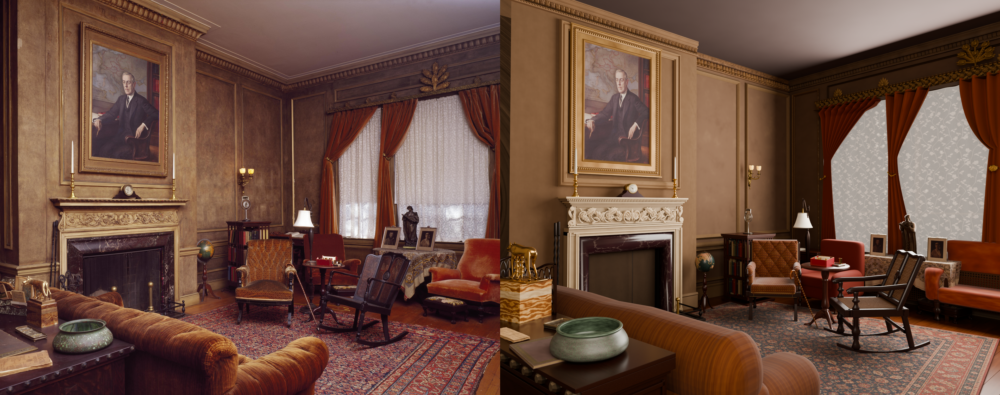
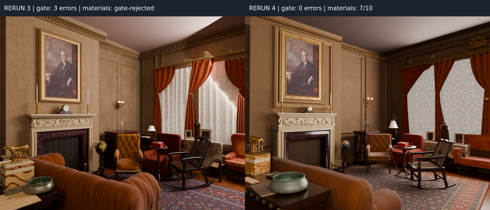

# Wilson House: fourth rerun

The run **completed with a normal driver exit and no supervised finalization**. There was no stop or continuation. Two GPU waits stalled tier-review renders, and one of those reviews then reached the driver's model-call bound. All **83 detail assets were built**. The 77 observed objects all finalized, with mean best score **7.48/10** and 43 at 8 or above. The six inferred structures were built unscored.

The scene **passed the observed spatial gate with 0 errors**, against rerun 3's 3. Both scored integration attempts and the materials attempt measured 0 errors. For the first time in these reruns, the in-run scene critics ran: integration scored 7 and then 6, and materials scored **7/10**. Detail rejected 27 attempts on 19 objects whose lone-placed asset missed its contract, including the rocker ([#58](https://github.com/bddap-bot/photo-to-scene/issues/58)). The open seam at the west/north wall corner below the cornice is gone.

[Full final render](renders/final.png) · [Scored attempts and verdicts](scores.md) · [Source attribution](ATTRIBUTION.md) · [Rerun 3 report](../rerun-3/report.md) · [Design and comparison](../../../experiments/wilson-house-rerun-4/README.md)

## Before and after

Both runs used `gpt-6-astra` at reasoning effort `none`, so model configuration is not a confound. All 720 model calls in this run reported that model and effort `none`.

| Measure | Rerun 3 | Rerun 4 |
|---|---|---|
| Workflow | Fresh state on `f5ca045`; one continuation at `detail` after an infrastructure stop; normal driver exit | Fresh state on `5acde1f`; one continuous run; normal driver exit |
| Final observed spatial gate | Fail; 3 errors at materials on the current assembly; integration 3 errors on each of 9 attempts | **Pass; 0 errors at materials; integration 0 errors on each of 2 scored attempts** |
| In-run scene critic | None: gate-rejected | Integration 7, then 6; materials 7 |
| Detail contract rejections | None: detail did not measure placed assets | 27 attempts on 19 objects (23 footprint or region deviations, 4 disjoint parts) |
| Tier composition reviews | 16 records: large 7 (nine times); medium 7 (four times); small 8, 7, 7 | 15 records: large 7, 7, 7, model stop, 7, 7, 8; medium model stop, 7, 7, 7, 7; small 7, 7, 7 |
| Detail objects finalized | 65/65 observed; mean 7.46/10; 34 at least 8; plus 2 inferred | 77/77 observed; mean 7.48/10; 43 at least 8; plus 6 inferred |
| Builder GOTO spend | 10, two per stage at most: detail 2, blockout 2 (to floorplan), large tier 1, small tier 1, integration 2, materials 2 | 7: detail 2, blockout 2 (to floorplan), large tier 1, medium tier 1, integration 1; materials none |
| Critic GOTO spend | 4 tier reviews to `object:sofa` | 5: four tier reviews to blockout; integration 1 to `object:ceiling` |
| Refused repairs | 71 at caps (60 builder, all toward blockout; 11 critic within tiers); 0 invalid targets | 68 at caps (59 builder, all toward blockout; 8 critic within tiers; 1 integration critic); 0 invalid targets |
| Refused requests kept | None: dropped once detail's allowance was spent | 59 kept; 34 carried into 7 blockout entries; 1 left at finalization; at most 2 refusals per requester |
| Recorded attempts | 352 scored, 4 inferred, 10 redirects; 367 known sequences, one unrecorded (lost to the interruption) | 336 scored, 6 inferred, 7 redirects; 349 known sequences, none unrecorded |
| Summed attempt time | 126,155 s scored + 741 s inferred + 5,095 s redirected = 131,991 s (36.66 h) | 96,598 s scored + 627 s inferred + 4,145 s redirected = 101,370 s (28.16 h) |
| Model-call tokens | 22,051,723 | 22,008,913 |
| Driver-enforced model stops | 1: blockout attempt 212 reached its 2,100 s bound; 0 provider-capacity failures | 3 at the 2,100 s bound: blockout 71, medium-tier review 225, large-tier review 233; 2 provider-capacity failures |
| Final render call | 636 s Blender; 722 s from saved materials scene to `COMPLETE` | 867 s Blender; 1,024 s from saved materials scene to `COMPLETE` |
| End-to-end elapsed time | 133,078 s (36 h 57 min 58 s); the interruption gap was under a minute | 102,688 s (28 h 31 min 28 s) |

This is one stochastic run per workflow, not a per-fix ablation. The inventories differ, at 67 and 83 objects, and visual critic scores are subjective. Detail spent fewer seconds on more objects: 61,884 s over 278 object records, against 84,944 s over 283.

The render keeps the room's layout: the fireplace wall and portrait, the window bay with drapes and pelmet crest, the seating group, the rocker and the foreground sofa with its back to the camera. The west/north corner below the cornice now meets cleanly. Its visible weaknesses are these:

- The ceiling shading is banded, as in rerun 3.
- The window wall is darker than in the photograph, and the lace has an oversized floral repeat.
- The drapes cut the lace panels into angular outlines.
- The foreground she-wolf figure, its plinth and the bowl are oversized.
- The sofa back is a flattened slab rather than the photograph's rounded roll.

## The west/north wall seam

Rerun 3's west wall ended at y = 6.600 m, and its north wall's inner face began at y = 6.625 m. That 25 mm gap was below the 30 mm footprint tolerance, and it rendered as a blue vertical line. In rerun 4, the rear west wall runs to y = 7.205 m and the north wall's face begins at y = 7.200 m, so they overlap by 5 mm. In the final render's corner band (x 1040–1179, y 330–899), rerun 3 has 2,775 pixels with a blue cast, in a 5-pixel column over 555 rows; rerun 4 has none.

The new detail check rejected no wall asset. The seam closed because this run's wall assets meet, not because the check caught a gap. A gap under 30 mm would still pass detail.

## Method and provenance

The [design](../../../experiments/wilson-house-rerun-4/README.md) was landed before execution. The run began from an empty directory on `5acde1f9f6ec5a8cde09e791ff1f499829171bda`, which holds the fixes for #58–#61. The workflow ran from an exported tree of that revision. No prompts, budgets, driver code or scene assets were changed.

The input was the original 6114×4842 Library of Congress photograph, credited in [the example attribution](../ATTRIBUTION.md), SHA-256 `2f51726bfcb4f24445bb301131ad322f278d5f2412bfa4f926f6d602799a735a`. The run used Codex CLI 0.156.0 and `gpt-6-astra` at reasoning effort `none`, the same as rerun 3. Rendering used Cycles on the CPU, as the final builder chose. The final image is 1920×1521, 256 adaptive samples, denoised.

Infrastructure did not stop the run, but it stalled it twice. During the medium-tier review (sequence 225), that review's render waited 2,440 s for a GPU held by another workload. The reviewer killed the render and re-rendered on the CPU, and the call then reached the 2,100 s bound, recording a model stop. The small-tier review's render waited 410 s and then completed. The large-tier review at sequence 233 also reached the bound with no GPU wait. Two provider-capacity failures cost one detail attempt each (`orange_chair`, `console`).

The stage 5/6 clock started at the first integration attempt and ran 2 h 22 min to `COMPLETE`, inside its 3.5-hour cap. The run finalized because the materials critic, scoring 7, named `materials` as its top stage. Materials makes one attempt per entry, so the driver then rendered that saved scene ([#62](https://github.com/bddap-bot/photo-to-scene/issues/62)). No step was supervised.

## Per-stage time and tokens

Identification re-ran after each blockout reentry, and its ten passes are shown separately. Tokens are summed from each call's reported total. Tier reviews have no stage-entry line, so their tokens fall under detail.

| Stage | Records | Seconds | Redirect seconds | Tokens |
|---|---:|---:|---:|---:|
| Floorplan | 7 | 1,493 | 0 | 468,623 |
| Blockout | 29 | 15,609 | 1,126 | 2,789,781 |
| Identify | 10 | 1,868 | 0 | 577,211 |
| Detail | 278 (6 inferred) | 61,884 | 251 | 17,719,334 (with tier reviews) |
| Tier reviews | 15 | 13,578 | 538 | in detail |
| Integration | 2 | 2,158 | 2,230 | 286,341 |
| Materials | 1 | 635 | 0 | 167,623 |

## What the fixes demonstrated

| Fix | Observed in this run |
|---|---|
| #58 | Detail placed each asset alone and rejected 27 attempts on 19 objects with the measured deviation. Examples: `bowl: footprint did not round-trip: the placed outline lies up to 0.071 m from footprint_xy, tolerance 0.030 m`, and the rocker's footprint twice. Every final asset passed, so integration and materials measured 0 errors and no gate verdict needed routing to an asset owner. The wall seam is gone, but by different wall geometry, not by a detail rejection. |
| #59 | Every facing error the gate raised named a floorplan wall: the chimney returns, and one chair placed against the window wall. No requirement came from a furniture front, and no floorplan GOTO was advised for furniture. |
| #60 | All 59 builder requests refused at a cap were kept. Seven dispatched blockout GOTOs carried 34 of them, and one was left at finalization and listed in `scores.md`. No requester was refused more than twice, against 11 refusals for rerun 3's drape tiebacks. The ceiling builder's kept diagnosis, area lights cutting the ceiling plane, reached the next blockout entry, and the final scene's emitters sit below the ceiling. |
| #61 | Not exercised: the stage 5/6 clock never expired. |

## Newly exposed workflow defect

Filed separately:

- [#62](https://github.com/bddap-bot/photo-to-scene/issues/62): a materials verdict below 8 whose top stage is `materials` finalizes the run. Materials makes one attempt, so the critic's own-stage corrections are never applied. Its object corrections (`object:sofa`, `object:window_lace`) are never routed, though materials' GOTO allowance was unspent. This run is the first whose materials critic ran, and it determined the finalization.

## Published evidence

The directory retains the original photograph and input metadata; final `floorplan.json` and `objects.json`; the observed spatial measurement and gate result; the materials verdict; the render settings; derived measurements; and the scored-attempt report. Every published render and comparison was viewed before landing. The full execution transcripts, attempt records, scripts, selected scene and textures are kept in the run archive. Raw transcripts are not repository documentation.
