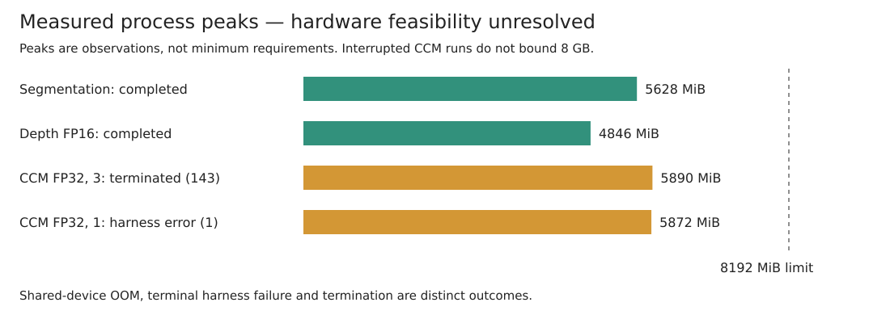

# Mira-Scene feasibility and layout experiment

Decision target: can measured per-object layout improve the existing blockout,
and can generated meshes replace procedural detail builders on an 8 GB GPU?
This is an evaluation dependency, not a workflow dependency. No workflow code changes.

## Design and method (recorded before evaluation)

- Input: only the [public example photograph](../../examples/wilson-house/source.jpg), Library of Congress highsm.17640; [source and rights](../../examples/wilson-house/ATTRIBUTION.md).
- Baseline workflow: `adbd61ae79ce9be1e5839ebaa801fb4d86f6e9a9`.
- Evaluation dependency: Mira-Scene, with its exact source revision and checkpoint IDs to be recorded in the results.
- First settle checkpoint licenses and hardware feasibility for GeForce RTX 2080, 8192 MiB. Inspect the released pipeline and primary model documentation. Clone third-party source into isolated scratch; run any installation or inference through `run-untrusted`. Do not use bundled scene images.
- If a documented binding memory requirement exceeds this GPU and no supported fitting configuration is established, stop at box 1. Record that bound, distinguish it from measured peak memory, and leave inference runtime and candidate scores unmeasured.
- Otherwise run only the public input, retain per-instance transformations, and compare footprint, front and scale with the existing blockout using `tools/spatial-contract.py`. This gate checks contracts and observed invariants, not independent photo ground truth. Keep photo assessment distinct from contract conformity.
- Assess the plugged-in mesh backend separately: version, checkpoint licenses, memory including available FP8/offload modes, output formats and whether its transformations support footprint, front and aperture validation.
- Publish a results table. A demonstrated layout win opens a design issue for seeding `objects.json` without changing builders; failure of hardware feasibility or a measured loss closes #24. Do not claim a visual or spatial loss without inference.

## Initial results (superseded; retained as evaluation history)

The initial hardware ruling below was withdrawn: mesh requirements do not bind
the layout half. The current decision is **unresolved**, as explained in the
corrected measured results below.

**Stop at box 1; reject adoption on this GPU.** The released complete pipeline has
no established supported configuration within 8 GB. This is a hardware-feasibility
loss, not a measured layout-quality loss. No candidate inference, generated mesh,
render, or photo-based comparison was performed. No integration design issue is
warranted. Close #24 with the table below; reopen only with a fitting, validated
pipeline configuration or a larger GPU.

| Measure | Existing blockout / procedural detail | Mira-Scene candidate |
|---|---|---|
| Workflow SHA | `adbd61ae79ce9be1e5839ebaa801fb4d86f6e9a9` | Same evaluation baseline |
| Mira-Scene evaluation dependency | — | `653cba6f4ca328797d44fd7357087573b873366a` |
| GPU inventory, checked through the sandbox | — | NVIDIA GeForce RTX 2080, **8192 MiB** |
| Binding published GPU requirement | No new baseline inference | SAM3D **at least 32 GB**; TRELLIS.2 **at least 24 GB**; both exceed 8 GiB even interpreting GB as decimal |
| Fresh existing spatial gate, declaration-only | **99 objects, 0 errors, valid**, exit 0 | Not run: no candidate contracts |
| Gate runtime | **0.559 s**, one declaration-only invocation | Inference runtime **not measured**; 0 inference calls |
| Observed geometry gate | Previously recorded **0/10, 68 errors** | **N/A**, no generated geometry |
| Footprint / region errors | Previously recorded **36 / 26**, plus **6** support errors | **N/A** |
| Front and scale vs photograph | No new independent measurements | **N/A** |
| Layout decision | Retain current workflow; known errors remain | Feasibility loss at box 1; quality undecided |
| Detail-backend decision | Retain procedural builders | No demonstrated replacement on this GPU |

The [fresh declaration result](baseline-contract-check.json) comes from the
unchanged `tools/spatial-contract.py`, all IDs in `examples/wilson-house/objects.json`,
default tolerance 0.03 m, without `--observed`. It does **not** contradict the
[previous final-scene failure](../../examples/wilson-house/report.md): that gate
checked observed geometry. The 68-error result was not rerun here. The source
photograph is the only eligible scene input; no bundled demonstration scene was
used. Source inspection and model metadata reads do not constitute inference.
Third-party source was cloned into isolated scratch; no third-party install or
inference was executed. The sandbox GPU inventory command succeeded.

### Mesh backend assessment

| Evaluation dependency | License | Memory and 8 GB verdict | Output and contract suitability |
|---|---|---|---|
| SAM 3D Objects, source `f91db411c50efee93d8db7aeb323885650f6f722`; default backend | SAM License for code and checkpoints; gated access and its use/redistribution conditions apply | Published minimum **32 GB**. No 8 GB execution established. No FP8/offload control in the inspected Mira-Scene SAM3D entry point | Per-instance **GLB**; downstream scene assembly exports object transforms. Geometry can support footprint/extent measurement after coordinate conversion, but does not supply semantic front or aperture contracts |
| TRELLIS.2, source `75fbf0183001ed9876c8dbb35de6b68552ee08bd`; selectable backend | Core code/model **MIT**; DINOv3 and RMBG retain separate terms | Published minimum **24 GB**. Adapter enables `low_vram` by default, moving stage models between CPU/GPU; this is not a documented 8 GB guarantee. No 8 GB execution established | Per-instance textured **GLB**, using CCM voxels as conditioning. Same downstream transform and semantic-contract limitations |
| TRELLIS.2 FP8 checkpoint, revision `b867be02d3dd9a73f460b576f12d44e9bdd4a370` | Model card says MIT | Inspected metadata only. Mira-Scene's loader has no FP8 selection/dequantization path. A separate quantized/offload implementation may fit; it was not validated and does not establish support for this pipeline or GPU | No output generated or scored |

The published GPU requirements are **documentation bounds, not measured allocation
peaks or proofs that every possible port fails**. The full pipeline has additional
precision/kernel constraints: CCM explicitly selects BF16, while the installed
GPU class is Turing; upstream FlashAttention-2 supports BF16 on Ampere or newer.
A different attention/precision implementation needs validation. Quantization of
a mesh model alone does not validate CCM, segmentation, depth, or assembly.

The scene output includes `scene.glb`, `scene_with_floor.glb`, `scene.ply` and
`scene_optimization.json`. The JSON records per-object 4×4 transforms in initial,
gravity-adjusted and final camera/floor frames, preserving rotation, translation
and scale. Its floor frame is +Y up; the workflow uses XY footprints and Z height.
A consumer would need axis/unit calibration, stable instance-to-contract IDs,
semantic fronts, named regions and aperture observations. A projected mesh
footprint and bounding extents are measurable; front semantics and source-visible
aperture luminance cannot be inferred from a transform alone. Thus these artifacts
are potentially checkable geometry, not drop-in spatial-contract records. No
adapter was implemented.

### Checkpoint inventory and licensing

These are **declared evaluation dependencies**, not installed workflow dependencies.
No checkpoint was loaded. IDs below cover the released configuration and selectable
alternatives inspected; inclusion does not mean the model was executed.

| Role | Model ID / artifact | License or access finding |
|---|---|---|
| Required CCM | `Yang-Tian/Mira-Scene`, `pipeline/`, revision `e0bc99eec6ec6e2a22b81a8af1f323dd07dbdde6` | MIT for original model artifacts; retains third-party component terms. Includes DINOv2-with-registers image encoder; no separate encoder download used |
| Segmentation | `facebook/sam3` | SAM License, gated |
| Default depth | `gangweix/Pixel-Perfect-Depth` | Apache-2.0 model metadata |
| Default depth helper | `Ruicheng/moge-2-vitl-normal` | MIT model metadata |
| Default depth helper | `depth-anything/Depth-Anything-V2-Large` | CC BY-NC 4.0; not an unrestricted commercial workflow dependency |
| Alternative depth | `Ruicheng/moge-vitl` | MIT model metadata |
| Alternative / metric depth | `Ruicheng/moge-2-vitl` | MIT model metadata |
| Default mesh | `facebook/sam-3d-objects`, revision `2e73555018d2741ccd486e56c24fac41155a1dc6` | SAM License; anonymous checkpoint license-file request returned HTTP 401; public source license supplies the terms |
| Alternative mesh | `microsoft/TRELLIS.2-4B`, revision `af44b45f2e35a493886929c6d786e563ec68364d` | MIT |
| Alternative mesh image encoder | `facebook/dinov3-vitl16-pretrain-lvd1689m`, revision `ea8dc2863c51be0a264bab82070e3e8836b02d51` | DINOv3 License, gated |
| Alternative mesh background removal | `briaai/RMBG-2.0`, revision `5df4c9c76d8170882c34f6986e848ee07fd0ba43` | Noncommercial terms; commercial use requires separate agreement |
| Quantized mesh candidate, metadata only | `visualbruno/TRELLIS.2-4B-FP8` | MIT model metadata; unvalidated loader compatibility |

Hosted model IDs in the inspected defaults are `gemini-2.5-pro` (segmentation),
`gemini-3.1-flash-image-preview` (mesh conditioning redraw) and `gpt-image-2`
(optional floor texture/environment). No API was invoked. The upstream TRELLIS.2
full pipeline also references `microsoft/TRELLIS-image-large` for its sparse
structure decoder; the Mira-Scene adapter loads the five shape/texture models
and consumes CCM voxels instead. No such extra checkpoint was downloaded.

The original CCM and core TRELLIS.2 licenses permit use with their license
conditions; this does **not** make the assembled default pipeline wholly MIT.
Noncommercial depth/background-removal terms and gated model agreements remain
separate adoption constraints. This evaluation does not authorize commercial use
of those restricted dependencies.

### Primary evidence

- [Pinned Mira-Scene inference and checkpoint guide](https://github.com/VAST-AI-Research/Mira-Scene/blob/653cba6f4ca328797d44fd7357087573b873366a/infer_scripts/docs/environment.md), [mesh adapter](https://github.com/VAST-AI-Research/Mira-Scene/blob/653cba6f4ca328797d44fd7357087573b873366a/infer_scripts/3_trellis2_mesh.py), [scene output](https://github.com/VAST-AI-Research/Mira-Scene/blob/653cba6f4ca328797d44fd7357087573b873366a/infer_scripts/5_construct_scene.py).
- [Mira-Scene weights and license](https://huggingface.co/Yang-Tian/Mira-Scene/blob/e0bc99eec6ec6e2a22b81a8af1f323dd07dbdde6/README.md).
- [SAM3D hardware requirement](https://github.com/facebookresearch/sam-3d-objects/blob/f91db411c50efee93d8db7aeb323885650f6f722/doc/setup.md), [license](https://github.com/facebookresearch/sam-3d-objects/blob/f91db411c50efee93d8db7aeb323885650f6f722/LICENSE).
- [TRELLIS.2 hardware and licensing](https://github.com/microsoft/TRELLIS.2/blob/75fbf0183001ed9876c8dbb35de6b68552ee08bd/README.md), [offload implementation](https://github.com/microsoft/TRELLIS.2/blob/75fbf0183001ed9876c8dbb35de6b68552ee08bd/trellis2/pipelines/trellis2_image_to_3d.py).
- [RMBG terms](https://huggingface.co/briaai/RMBG-2.0), [DINOv3 terms](https://huggingface.co/facebook/dinov3-vitl16-pretrain-lvd1689m), [depth checkpoint terms](https://huggingface.co/depth-anything/Depth-Anything-V2-Large), [FP8 metadata](https://huggingface.co/visualbruno/TRELLIS.2-4B-FP8).
- [FlashAttention GPU/precision support](https://github.com/Dao-AILab/flash-attention#nvidia-cuda-support), [Mira-Scene paper](https://arxiv.org/abs/2609.23796). Published benchmark gains are not measurements on this photograph.

## Measured layout run: design and stop rule (recorded before execution)

The ruling above rests on published mesh-backend minimums. Mira-Scene's layout
does not use a mesh: `5_construct_scene.py` solves each object's pose and scale
with `solve_similarity_transforms` from the CCM, the depth point map and the
instance masks; meshes enter only later support placement and GLB export. The
stages that produce the layout were never run on this GPU. This run measures
them and then compares the layout with the blockout. The earlier baseline
numbers stand.

**Stages.** Segmentation, depth (released default: Pixel-Perfect Depth with its
MoGe-2 and Depth Anything V2 helpers; `--enable_metric` for metric scale),
CCM (`2_inference_CCM.py` at its released defaults, pinned source above) and the
mesh-free initial layout solve. Every third-party install and inference step runs
through the bubblewrap sandbox on the GeForce RTX 2080 (8192 MiB). The GPU is
shared with resident processes; their memory is recorded at the start of each stage.

**Measures, per stage and scene.** Peak PyTorch allocated and reserved memory
inside the stage process; peak device memory sampled every 0.5 s minus the
pre-stage baseline; wall-clock time with model load reported separately.

**Fitting ladder.** Each stage runs at its released defaults first. On an
out-of-memory failure it retries, in order, with model CPU offload, then the
xformers attention backend (the PyTorch backend if xformers has no build for
compute capability 7.5), then both. If BF16 kernels are unavailable on this
architecture, FP16 and then FP32 are tried and the precision is recorded. CCM
batches every instance of a scene together, so if the full instance set does
not fit at the last rung, the largest instance count that fits is found by
halving and the scene runs in groups of that size, recorded as a deviation.

**Stop rule.** A stage is feasible when some rung completes the Wilson House
input within 8192 MiB of device memory and 60 minutes of wall time. It is
infeasible when every rung fails; the binding number is the failing allocation
or the elapsed time. The layout half is feasible when depth, CCM and the layout
solve are all feasible. A checkpoint behind an access agreement this evaluation
holds no account for is not obtained: its stage is recorded as blocked, not
infeasible, and an ungated model with the same interface substitutes for it. For
segmentation that substitute is SAM 2.1 (`facebook/sam2.1-hiera-large`), box-prompted
with each blockout object's `crop_bbox`, which also carries the blockout's object
IDs through to the comparison. If the layout half is infeasible, box 1 stops
with that number.

**Mesh backend.** TRELLIS.2 runs once on one instance with the adapter's default
`low_vram`, and what happens is recorded: output, peak memory and time, or the
exact failure.

**Comparison.** Objects: every blockout object with a `crop_bbox`, except the
room shell (`floor`, `ceiling`, `wall_w`, `north_*`, `cornice_n`, `baseboard_n`),
which also supplies no instance for CCM. Mira-Scene's camera-space transforms
enter the blockout's room frame through the blockout's own camera
(`floorplan.json`), with no fitting to objects; the canonical front is -Y, the
glTF front after the pipeline's canonical alignment. For each object:

1. *Photo alignment*: IoU between the image-space box of each layout's projected
   3D box, each through its own camera, and the box of the object's mask.
2. *Contract gate*: `tools/spatial-contract.py` on the blockout's contracts, with
   Mira-Scene's footprint, front and body region as the observed record, at the
   default 0.03 m tolerance; errors counted by kind.
3. *Deviation*: footprint-centre distance, front angle and extent ratios.

Photo alignment favours a pixel-aligned method by construction and uses the same
masks and depth Mira-Scene fits to; it measures agreement with the observations,
not ground truth. **Decision rule:** Mira-Scene wins when its median per-object
photo IoU exceeds the blockout's by at least 0.10 and it is higher on at least
60 % of compared objects. A win opens the design issue named in #24; otherwise
#24 closes with the table.

## Measured layout run: results

**Unresolved: the prior box-1 hardware-loss ruling is withdrawn.**
Segmentation and depth completed. FP16 CCM produced only NaNs. However, the
FP32 offload rung did not establish hardware infeasibility: the single-instance
attempt logged five OOM events, then crashed with a CPU/CUDA device mismatch in
DINOv2 `fc1` (exit 1). The three-instance attempt logged four OOM events before
termination (exit 143). These are interrupted or invalid harness runs, not
20 failed retries. The BF16 three-instance run likewise ended with exit 143
following five logged OOM events.

The device exposes 7,782 MiB usable memory. Other allocations reduced what was
free during those attempts. The three-instance FP32 peak was 5,890 MiB with
1,804 MiB held elsewhere; the single-instance peak was 5,872 MiB. Neither is
proof that CCM exceeds the pre-registered 8,192 MiB limit. Failing against free
memory on a shared device does not rule out the GPU class. The report therefore
withdraws the hardware loss and leaves box 1 unresolved; comparison is pending,
not forbidden by an established stop-rule failure.

The memory figure now distinguishes interrupted FP32 attempts from completed
stages. Corrected per-attempt outcomes are in
[measured-run.json](measured-run.json); [audit excerpts](evidence-audit.md)
record the terminal errors and observed retry counts without machine details.

| Stage | Model | Configuration that finished, or the binding number | Peak memory | Runtime |
|---|---|---|---|---|
| Segmentation | `facebook/sam2.1-hiera-large` (substitute; `facebook/sam3` is access-gated) | FP32, 90 box prompts from the blockout's `crop_bbox` | 4,924 MiB allocated, 5,628 MiB process | 326 s |
| Depth | `gangweix/Pixel-Perfect-Depth` + `Ruicheng/moge-2-vitl-normal` + `depth-anything/Depth-Anything-V2-Large`, metric scale from `Ruicheng/moge-2-vitl` | Model offload + FP16 (released BF16 run out of memory; offload alone asked for an 8.80 GiB attention block) | 4,428 MiB allocated, 4,846 MiB process | 2,995 s |
| CCM | `Yang-Tian/Mira-Scene` `pipeline/` rev `e0bc99e` | Unresolved. FP16 output is NaN; FP32 single-instance harness crashed after 5 OOM events; FP32 three-instance run was terminated after 4 | FP32 single-instance: 5,704 MiB allocated / 5,872 MiB process; not an 8 GB bound | single-instance attempt 319.99 s; no complete scene |
| Layout solve | `solve_similarity_transforms` | not reached | — | — |
| Mesh (TRELLIS.2, `low_vram`) | `microsoft/TRELLIS.2-4B` | not reached: its image encoder `facebook/dinov3-vitl16-pretrain-lvd1689m` and `briaai/RMBG-2.0` refuse anonymous download ("Access denied. This repository requires approval.") | — | — |

Runtimes include model loading and resource contention. Every attempt's figures
are in [measured-run.json](measured-run.json).

### Deviations and observations

- **SAM3 substitution.** The `facebook/sam3` weights need an access agreement this
  evaluation holds no account for. SAM 2.1, prompted with each blockout object's
  `crop_bbox`, produced the 90 instance masks (median predicted mask quality 0.90)
  and carried the blockout's object IDs through.
- **Offload needed a patch.** The released `CCMVoxelPipeline` declares no model
  offload order, so diffusers refuses to offload it. The evaluation set the order
  to image encoder → transformer → VAE.
- **Instance groups.** CCM batches every instance together, but its attention
  runs within each instance, so splitting the 90 instances into groups changes
  only the noise draw. The run halved the group size from 90 to 3; FP32 was also
  tried with single instances.
- **Retries.** A configured retry limit of 20 was incorrectly reported as an
  observed count. The corrected counts and terminal statuses are recorded above.
  Retrying a partially offloaded pipeline after OOM may leave inconsistent device
  placement. A new measurement must use a fresh process after any OOM; the failed
  harness is not evidence of a model or hardware limitation.
- **Center crop.** The released CCM stage resizes the photograph to 518 pixels on
  its short side and center-crops a square. That drops about 10 % of the
  1529×1211 frame on each side: 7 of the 90 instances lie wholly outside the crop
  and 16 partly. A non-square photograph needs letterboxing before this stage.
- **Numerics.** Depth runs correctly in FP16; CCM does not. Its precision has
  to be BF16 or FP32, and on Turing BF16 has no memory-efficient attention.

### Decision

Box 1 remains unresolved. Keep #24 open with boxes 1 and 3 unchecked. No design
issue is warranted before a measured win; no loss has been established. The
segmentation and depth results stand, as do the recorded baseline gate results.
A clean FP32 diagnostic has now completed one instance (see below). The complete
scene, layout solve and both spatial-contract scores remain to be measured. An 8 GB
card with approximately 6 GB free already meets the earlier proposed reopen
condition, so that condition cannot support a hardware rejection.

### Clean FP32 rerun method (recorded before execution)

Rebuild the isolated evaluation environment from the pinned Mira-Scene source.
Regenerate the same SAM 2.1 box-prompted masks from the sole public input; retain
model revisions and the ID order. Use FP32 CCM with groups of one, the released
sampling settings, and model CPU offload in image-encoder → transformer → VAE
order. The scratch harness uses the pipeline execution device, rather than the
current transformer-parameter device, for offloaded inputs. There is no in-process
OOM retry: an error terminates that attempt. Check every produced CCM for finite
values and retain the voxel counts. Record load-inclusive elapsed time, allocated
and reserved peaks, device availability, and the actual terminal status.

The original 60-minute stage bound applies to a complete scene, not to one
instance. A timeout or OOM under competing allocations is reported with that
qualification; a harness error or interruption leaves feasibility unresolved.
If model offload still fails against available memory, a separately labelled
sequential-offload attempt may measure whether a smaller residency fits; it is
an additional configuration, not evidence that the original rung completed.

### Gate version check

A fresh declaration-only check using the pinned baseline gate
(`adbd61ae79ce9be1e5839ebaa801fb4d86f6e9a9`) again reports 99 objects and zero
errors. The current gate, after `0359029`, reports six support-declaration errors
on those same objects: two missing support-region identifiers and four vertical
support offsets. These are the previously documented support contradictions,
now caught earlier. Neither declaration-only result is a new observed-geometry
score; the historical final-scene result remains 68 errors. Any candidate
comparison must identify the gate revision and use the same gate for both layouts.

### Clean rerun: measured results

**FP32 CCM fits and produces finite output for one instance.** The earlier claim
that this GPU has no numerically valid fitting configuration is disproven. This
diagnostic does not establish a complete-scene runtime or layout-quality result.

| Rerun | Outcome | Peak allocated / reserved / process | Time |
|---|---|---|---|
| SAM 2.1, same 90 boxes, one prompt per call | All masks regenerated | 1376 / 1812 / 1954 MiB | 107.09 s; 16.22 s loading |
| FP32 model offload, one instance, default allocator | Genuine transformer OOM: 172 MiB request with 139.5 MiB free; exit 1 | 5432 / 5738 / 5880 MiB | 71.98 s |
| FP32 model offload, one instance, expandable allocator | **Completed**, finite CCM, **4033 voxels**, exit 0 | **5426 / 5630 / 5772 MiB** | **279.42 s** |
| Complete scene, layout solve, spatial-contract comparison | Pending | — | Not measured |

The successful case is `mantel`, first in the 90-instance order, using the
released 30 denoising steps and the original source image. The allocator option
is `PYTORCH_CUDA_ALLOC_CONF=expandable_segments:True`, an additional fitting
configuration. Both attempts used fresh processes and the corrected execution
device; neither retried after OOM. The successful run began with 5865.5 MiB free.
Output checks found finite CCM values and 4033 occupied voxels; no layout score
is inferred from these checks. Process peaks were sampled during execution;
PyTorch peaks were measured inside the process. The outer supervisor recorded
76.55 s and 288.17 s respectively, including process startup and supervision.

CCM weights remain `Yang-Tian/Mira-Scene`, revision
`e0bc99eec6ec6e2a22b81a8af1f323dd07dbdde6`, and source remains
`653cba6f4ca328797d44fd7357087573b873366a`. SAM 2.1 was pinned to
`665f8e2ad61cf5f53d65644ff27c8ee525124610`. The rebuilt environment uses
PyTorch 2.5.1+cu124, xformers 0.0.28.post3, diffusers 0.40.0, transformers
5.17.0 and accelerate 1.15.0. Checkpoint downloads and all install/inference
steps ran in the sandbox. No mesh stage or additional scene image was used.

**Decision remains open.** The 60-minute bound is for a complete scene, not this
single-instance diagnostic. Do not extrapolate a hardware rejection from its
runtime. Remaining work is a complete-scene measurement with controlled GPU
contention, the larger instance-group checks where memory permits, the layout
solve, and the paired gate/photo comparison. Masks and
the successful CCM output have been retained for continuation.

Depth was also regenerated and retained for continuation: **756.84 s** inside
the measurement wrapper (**766.99 s** including supervision), **2908 MiB
allocated / 3060 MiB reserved / 3242 MiB process peak**, exit 0. It used FP16
PPD weights and autocast, explicitly moving the semantic encoder, depth model
and MoGe helpers between CPU and GPU. The metric scale was **1.0790084** over
**1,829,907 shared valid pixels**. Timing includes loading and contention; a
GPU reservation was acquired near completion, so this is not an isolated timing
comparison with the earlier depth run.

The evaluation-only depth sources were Pixel-Perfect Depth
`427a86f5882aa3f7233c1b94fbdccce87f1c8313` and MoGe
`74fbce054ebed49800de42d0ad0e83495065719a`; checkpoint IDs and exact revisions
are recorded in the depth-regeneration entry of [measured-run.json](measured-run.json).
The successful single-instance CCM and completed depth do not settle the
complete-scene 60-minute bound or the paired spatial-contract comparison.

### Clean grouped CCM measurements

The same source, checkpoints, 30 denoising steps, model CPU offload and expandable
allocator were tested in fresh processes without OOM retries. Both precisions
used the PyTorch attention backend.

| Configuration | Terminal result | Process peak (MiB) | Wrapper runtime (s) |
|---|---|---:|---:|
| FP32, 3 instances | OOM: 226 MiB request with 145.62 MiB free | 6910 | 35.35 |
| BF16, 1 instance | Attention OOM: 2.67 GiB request; 5.46 GiB process memory at failure | 5588 | 19.91 |
| FP32, 2 instances | Finite CCM; 3441 and 11756 voxels; exit 0 | 6912 | 346.63 |

The two-instance FP32 run used **6396.25 MiB allocated / 6770 MiB reserved**;
supervised runtime was **348.83 s**. Saved arrays were independently checked
for finite values. This is a successful two-instance diagnostic, not the full
90-instance scene. Its runtime is not extrapolated into a scene-level loss.

The BF16 process memory plus requested allocation exceeds 8 GiB for that
configuration. The three-instance FP32 failure still does not demonstrate an
8192 MiB requirement: available memory remained reduced by other allocations.
The next three-instance attempt requires more available memory; the initial
7000 MiB availability target was insufficient. **The decision remains open**
until the remaining fitting checks, complete-scene runtime and paired layout
scores are measured. No workflow code changed.

With **7418 MiB initially free**, three-instance FP32 still failed in fresh
processes: the expandable allocator requested **130 MiB with 185.06 MiB free**
(**7232 MiB process peak, 30.50 s**); the CUDA asynchronous allocator raised
`torch.OutOfMemoryError` without a requested size (**7298 MiB, 16.40 s**).
Neither establishes an 8192 MiB requirement. See the exact terminal evidence in
[evidence-audit.md](evidence-audit.md).

A two-instance **CPU layout-solve diagnostic** completed in **0.71 s** using the
saved CCM and PPD point map. Depth points were resized by the shorter side and
center-cropped to the same 518×518 canvas as CCM, with bilinear point interpolation
and nearest-neighbor validity. The pinned similarity solver returned finite
transforms with **7707 and 6336 correspondences**, with no identity fallback.
This verifies the solve inputs for those two instances; it is not a complete-scene
layout or a paired spatial/photo score.

The native CCM transformer calls PyTorch scaled-dot-product attention. An earlier
reference to an automatically selected sparse backend does not establish an
explicit xformers attention measurement; that fitting rung remains to be exercised.

### Supplemental fast configuration, before quality scoring

Clean FP16 failed with a non-finite layout residual before transformer block 11's
normalization. Experimental mixed FP16/FP32 variants succeeded for one instance
but failed for larger input groups, including a later cross-attention projection.
Those variants are not established scene configurations and are not used for the
comparison. The transformer source is restored to the pinned implementation;
only the documented CPU-offload execution-device correction remains.

The next configuration uses **FP32, model CPU offload, explicit xformers CUTLASS
attention, 10 denoising steps and guidance scale 1**. The last two are supported
inference arguments, changed from the released 30 steps and guidance 3. This is
an additional fast configuration, not a measurement of released-default quality
or runtime. It adds no checkpoint, image, mesh, fitted camera or fitted object
transform. It keeps the **8192 MiB / 60-minute complete-scene limit** and the
registered **median photo-IoU improvement ≥0.10 and improvement on ≥60% of
objects** decision rule.

All 90 eligible object IDs remain in the comparison denominator. Missing or
invalid transforms, including instances lost by the released center crop, receive
zero candidate photo IoU and a missing-observation gate result; they are not
dropped to improve the score. Invalid transforms are not replaced by identity
poses. The baseline is the stored blockout layout and its bounding boxes; its
historical rendered-geometry score remains a separately labeled result.

Before computing the paired scores, the box convention is fixed symmetrically:
both photo scores project **world-axis-aligned 3D bounding boxes** through each
layout's own camera. The baseline boxes come from the stored object metadata;
the candidate boxes and footprint hulls come from its transformed occupied voxel
cells at resolution 64. Voxel cells include their half-cell extent, rather than
using only center points. No mesh generation or object alignment fit is added.
Candidate body regions use those world bounds; additional semantic regions and
appearance measurements are not fabricated. The gate's missing-appearance errors
are reported as unmeasured fields, not evidence of black rendered apertures.
